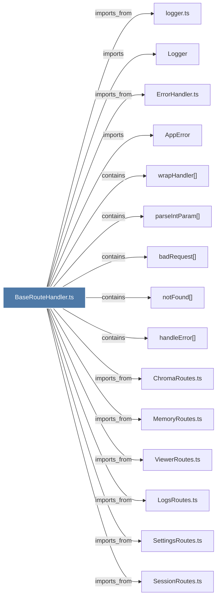

# BaseRouteHandler.ts

> [!info] Properties
> **File Type**: code
> **Community**: [[_COMMUNITY_Community None|Community None]]
> **Degree**: 18

## Architecture Graph


## Outbound Connections
- [[AppError]] - `imports` [EXTRACTED]
- [[ChromaRoutes.ts]] - `imports_from` [EXTRACTED]
- [[CorpusRoutes.ts]] - `imports_from` [EXTRACTED]
- [[DataRoutes.ts]] - `imports_from` [EXTRACTED]
- [[ErrorHandler.ts]] - `imports_from` [EXTRACTED]
- [[Logger]] - `imports` [EXTRACTED]
- [[LogsRoutes.ts]] - `imports_from` [EXTRACTED]
- [[MemoryRoutes.ts]] - `imports_from` [EXTRACTED]
- [[SearchRoutes.ts]] - `imports_from` [EXTRACTED]
- [[SessionRoutes.ts]] - `imports_from` [EXTRACTED]
- [[SettingsRoutes.ts]] - `imports_from` [EXTRACTED]
- [[ViewerRoutes.ts]] - `imports_from` [EXTRACTED]
- [[badRequest()]] - `contains` [EXTRACTED]
- [[handleError()]] - `contains` [EXTRACTED]
- [[logger.ts]] - `imports_from` [EXTRACTED]
- [[notFound()]] - `contains` [EXTRACTED]
- [[parseIntParam()]] - `contains` [EXTRACTED]
- [[wrapHandler()]] - `contains` [EXTRACTED]

## Inbound Dependencies
> [!abstract]- Files that link here
```dataview
LIST
FROM [[BaseRouteHandler.ts]]
```

#graphify/code #graphify/EXTRACTED #community/Community_None