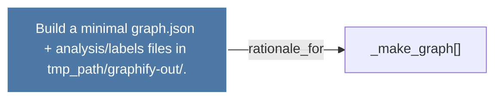

# Build a minimal graph.json + analysis/labels files in tmp_path/graphify-out/.

> [!info] Properties
> **File Type**: rationale
> **Community**: [[_COMMUNITY_Community None|Community None]]
> **Degree**: 1

## Architecture Graph


## Outbound Connections
- [[_make_graph()_3]] - `rationale_for` [EXTRACTED]

## Inbound Dependencies
> [!abstract]- Files that link here
```dataview
LIST
FROM [[Build a minimal graph.json + analysislabels files in tmp_pathgraphify-out.]]
```

#graphify/rationale #graphify/EXTRACTED #community/Community_None