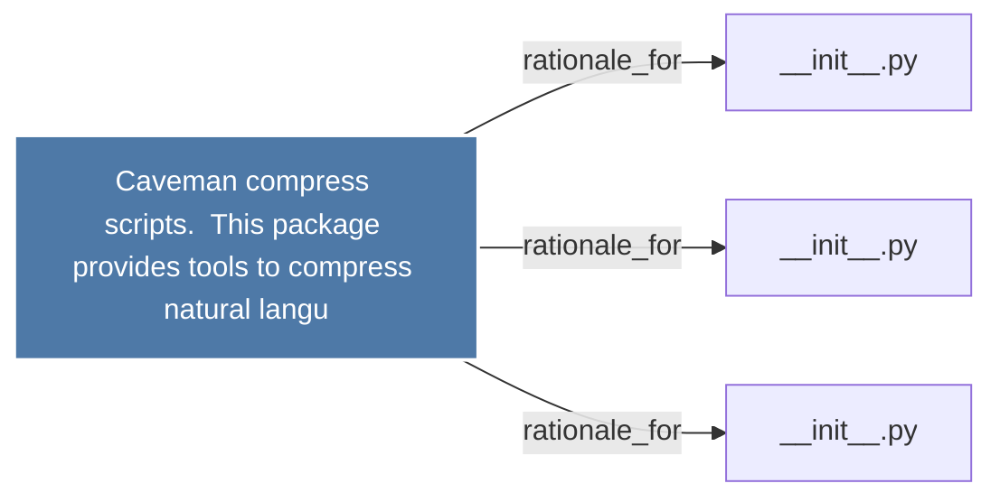

# Caveman compress scripts.  This package provides tools to compress natural langu

> [!info] Properties
> **File Type**: rationale
> **Community**: [[_COMMUNITY_Community None|Community None]]
> **Degree**: 3

## Architecture Graph


## Outbound Connections
- [[__init__.py_6]] - `rationale_for` [EXTRACTED]
- [[__init__.py_7]] - `rationale_for` [EXTRACTED]
- [[__init__.py_8]] - `rationale_for` [EXTRACTED]

## Inbound Dependencies
> [!abstract]- Files that link here
```dataview
LIST
FROM [[Caveman compress scripts.  This package provides tools to compress natural langu]]
```

#graphify/rationale #graphify/EXTRACTED #community/Community_None