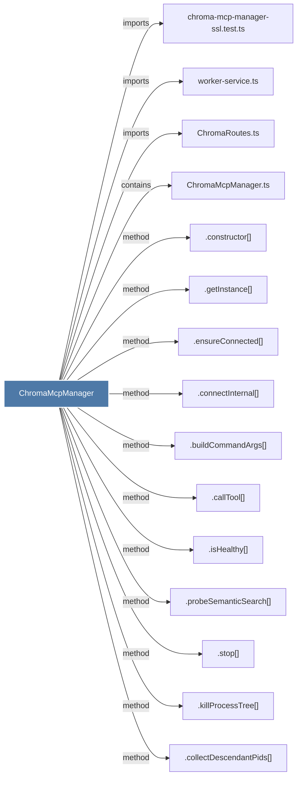

# ChromaMcpManager

> [!info] Properties
> **File Type**: code
> **Community**: [[_COMMUNITY_Community None|Community None]]
> **Degree**: 20

## Architecture Graph


## Outbound Connections
- [[.buildCommandArgs()]] - `method` [EXTRACTED]
- [[.callTool()]] - `method` [EXTRACTED]
- [[.collectDescendantPids()]] - `method` [EXTRACTED]
- [[.connectInternal()]] - `method` [EXTRACTED]
- [[.constructor()_42]] - `method` [EXTRACTED]
- [[.ensureConnected()]] - `method` [EXTRACTED]
- [[.getCombinedCertPath()]] - `method` [EXTRACTED]
- [[.getInstance()_2]] - `method` [EXTRACTED]
- [[.getSpawnEnv()]] - `method` [EXTRACTED]
- [[.isHealthy()]] - `method` [EXTRACTED]
- [[.killProcessTree()]] - `method` [EXTRACTED]
- [[.probeSemanticSearch()]] - `method` [EXTRACTED]
- [[.registerManagedProcess()]] - `method` [EXTRACTED]
- [[.reset()]] - `method` [EXTRACTED]
- [[.stop()_1]] - `method` [EXTRACTED]
- [[ChromaMcpManager.ts]] - `contains` [EXTRACTED]
- [[ChromaRoutes.ts]] - `imports` [EXTRACTED]
- [[ChromaSync.ts]] - `imports` [EXTRACTED]
- [[chroma-mcp-manager-ssl.test.ts]] - `imports` [EXTRACTED]
- [[worker-service.ts]] - `imports` [EXTRACTED]

## Inbound Dependencies
> [!abstract]- Files that link here
```dataview
LIST
FROM [[ChromaMcpManager]]
```

#graphify/code #graphify/EXTRACTED #community/Community_None