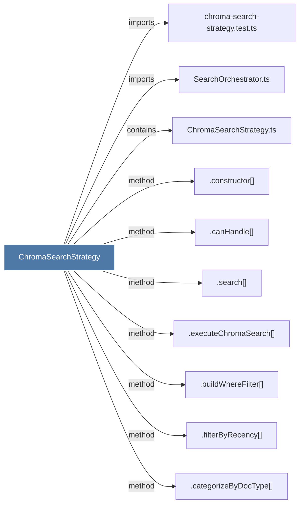

# ChromaSearchStrategy

> [!info] Properties
> **File Type**: code
> **Community**: [[_COMMUNITY_Community None|Community None]]
> **Degree**: 10

## Architecture Graph


## Outbound Connections
- [[.buildWhereFilter()]] - `method` [EXTRACTED]
- [[.canHandle()_2]] - `method` [EXTRACTED]
- [[.categorizeByDocType()]] - `method` [EXTRACTED]
- [[.constructor()_17]] - `method` [EXTRACTED]
- [[.executeChromaSearch()]] - `method` [EXTRACTED]
- [[.filterByRecency()]] - `method` [EXTRACTED]
- [[.search()_4]] - `method` [EXTRACTED]
- [[ChromaSearchStrategy.ts]] - `contains` [EXTRACTED]
- [[SearchOrchestrator.ts]] - `imports` [EXTRACTED]
- [[chroma-search-strategy.test.ts]] - `imports` [EXTRACTED]

## Inbound Dependencies
> [!abstract]- Files that link here
```dataview
LIST
FROM [[ChromaSearchStrategy]]
```

#graphify/code #graphify/EXTRACTED #community/Community_None