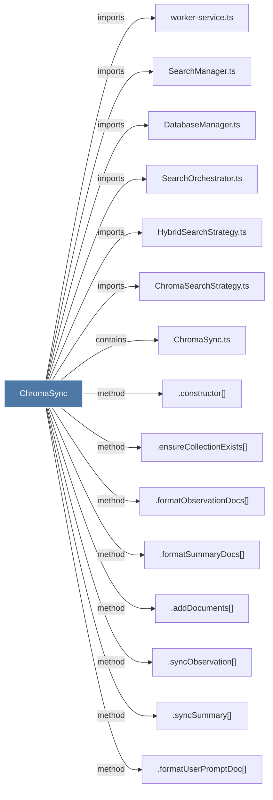

# ChromaSync

> [!info] Properties
> **File Type**: code
> **Community**: [[_COMMUNITY_Community None|Community None]]
> **Degree**: 29

## Architecture Graph


## Outbound Connections
- [[.addDocuments()]] - `method` [EXTRACTED]
- [[.backfillAllProjects()]] - `method` [EXTRACTED]
- [[.backfillObservations()]] - `method` [EXTRACTED]
- [[.backfillPrompts()]] - `method` [EXTRACTED]
- [[.backfillSummaries()]] - `method` [EXTRACTED]
- [[.bootstrapWatermarksFromChroma()]] - `method` [EXTRACTED]
- [[.close()_12]] - `method` [EXTRACTED]
- [[.constructor()_43]] - `method` [EXTRACTED]
- [[.deduplicateQueryResults()]] - `method` [EXTRACTED]
- [[.ensureBackfilled()]] - `method` [EXTRACTED]
- [[.ensureCollectionExists()]] - `method` [EXTRACTED]
- [[.formatObservationDocs()]] - `method` [EXTRACTED]
- [[.formatSummaryDocs()]] - `method` [EXTRACTED]
- [[.formatUserPromptDoc()]] - `method` [EXTRACTED]
- [[.getExistingChromaIds()]] - `method` [EXTRACTED]
- [[.queryChroma()_1]] - `method` [EXTRACTED]
- [[.runBackfillPipeline()]] - `method` [EXTRACTED]
- [[.syncObservation()]] - `method` [EXTRACTED]
- [[.syncSummary()]] - `method` [EXTRACTED]
- [[.syncUserPrompt()]] - `method` [EXTRACTED]
- [[.updateMergedIntoProject()]] - `method` [EXTRACTED]
- [[ChromaSearchStrategy.ts]] - `imports` [EXTRACTED]
- [[ChromaSync.ts]] - `contains` [EXTRACTED]
- [[DatabaseManager.ts]] - `imports` [EXTRACTED]
- [[HybridSearchStrategy.ts]] - `imports` [EXTRACTED]
- [[SearchManager.ts]] - `imports` [EXTRACTED]
- [[SearchOrchestrator.ts]] - `imports` [EXTRACTED]
- [[WorktreeAdoption.ts]] - `imports` [EXTRACTED]
- [[worker-service.ts]] - `imports` [EXTRACTED]

## Inbound Dependencies
> [!abstract]- Files that link here
```dataview
LIST
FROM [[ChromaSync]]
```

#graphify/code #graphify/EXTRACTED #community/Community_None