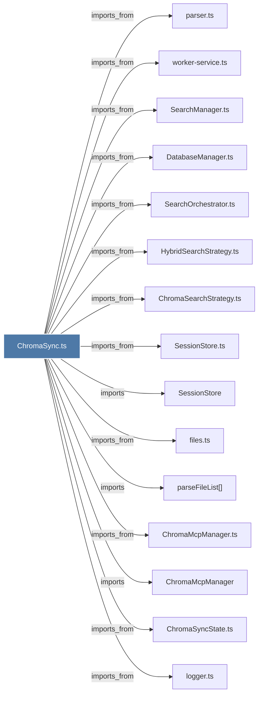

# ChromaSync.ts

> [!info] Properties
> **File Type**: code
> **Community**: [[_COMMUNITY_Community None|Community None]]
> **Degree**: 18

## Architecture Graph


## Outbound Connections
- [[ChromaMcpManager]] - `imports` [EXTRACTED]
- [[ChromaMcpManager.ts]] - `imports_from` [EXTRACTED]
- [[ChromaSearchStrategy.ts]] - `imports_from` [EXTRACTED]
- [[ChromaSync]] - `contains` [EXTRACTED]
- [[ChromaSyncState.ts]] - `imports_from` [EXTRACTED]
- [[DatabaseManager.ts]] - `imports_from` [EXTRACTED]
- [[HybridSearchStrategy.ts]] - `imports_from` [EXTRACTED]
- [[Logger]] - `imports` [EXTRACTED]
- [[SearchManager.ts]] - `imports_from` [EXTRACTED]
- [[SearchOrchestrator.ts]] - `imports_from` [EXTRACTED]
- [[SessionStore]] - `imports` [EXTRACTED]
- [[SessionStore.ts]] - `imports_from` [EXTRACTED]
- [[WorktreeAdoption.ts]] - `imports_from` [EXTRACTED]
- [[files.ts]] - `imports_from` [EXTRACTED]
- [[logger.ts]] - `imports_from` [EXTRACTED]
- [[parseFileList()]] - `imports` [EXTRACTED]
- [[parser.ts]] - `imports_from` [EXTRACTED]
- [[worker-service.ts]] - `imports_from` [EXTRACTED]

## Inbound Dependencies
> [!abstract]- Files that link here
```dataview
LIST
FROM [[ChromaSync.ts]]
```

#graphify/code #graphify/EXTRACTED #community/Community_None