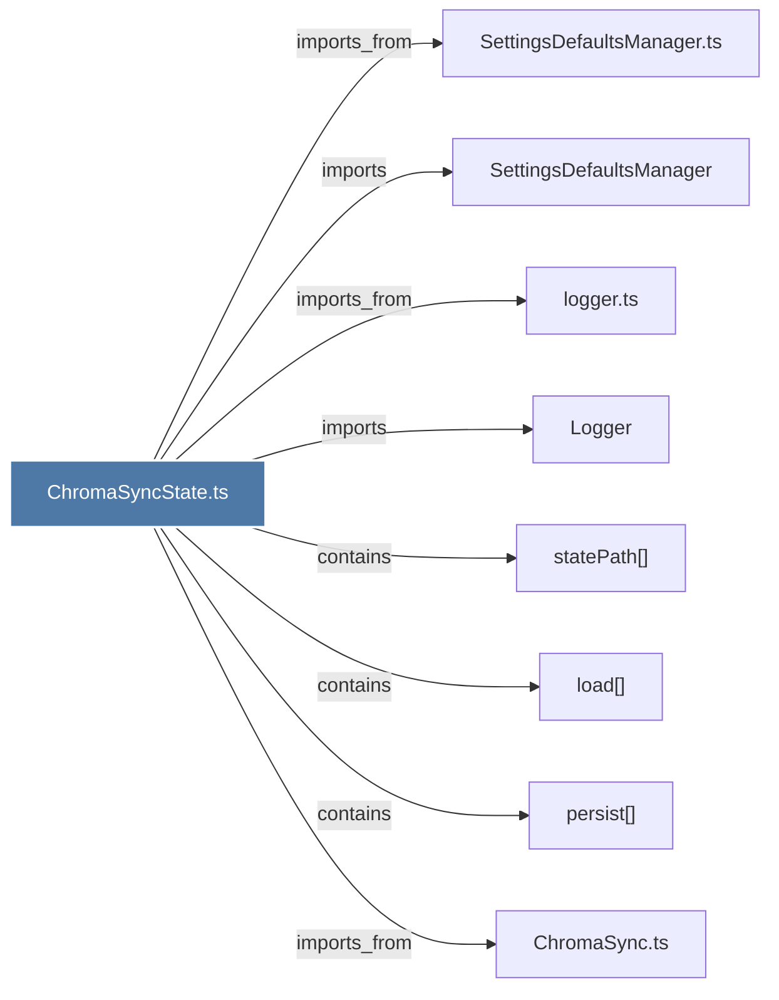

# ChromaSyncState.ts

> [!info] Properties
> **File Type**: code
> **Community**: [[_COMMUNITY_Community None|Community None]]
> **Degree**: 8

## Architecture Graph


## Outbound Connections
- [[ChromaSync.ts]] - `imports_from` [EXTRACTED]
- [[Logger]] - `imports` [EXTRACTED]
- [[SettingsDefaultsManager]] - `imports` [EXTRACTED]
- [[SettingsDefaultsManager.ts]] - `imports_from` [EXTRACTED]
- [[load()]] - `contains` [EXTRACTED]
- [[logger.ts]] - `imports_from` [EXTRACTED]
- [[persist()]] - `contains` [EXTRACTED]
- [[statePath()]] - `contains` [EXTRACTED]

## Inbound Dependencies
> [!abstract]- Files that link here
```dataview
LIST
FROM [[ChromaSyncState.ts]]
```

#graphify/code #graphify/EXTRACTED #community/Community_None