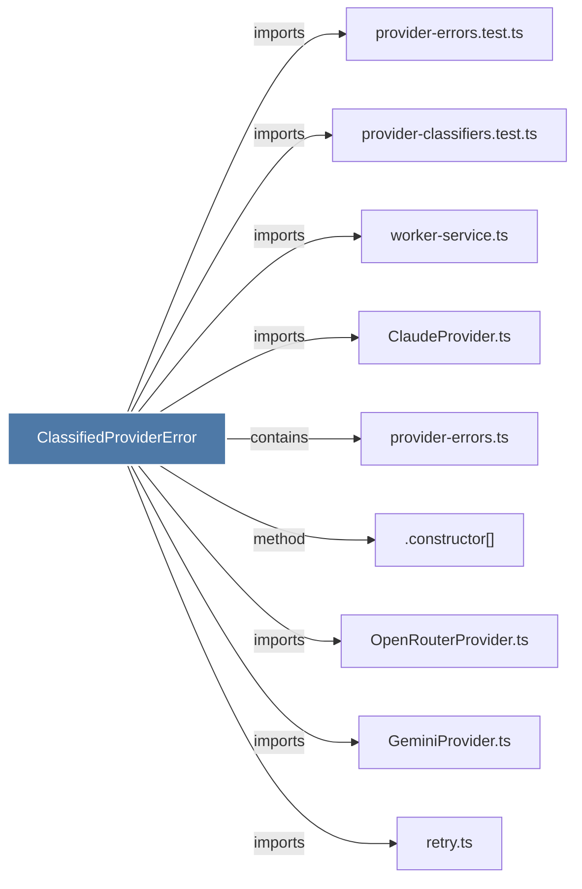

# ClassifiedProviderError

> [!info] Properties
> **File Type**: code
> **Community**: [[_COMMUNITY_Community None|Community None]]
> **Degree**: 9

## Architecture Graph


## Outbound Connections
- [[.constructor()_9]] - `method` [EXTRACTED]
- [[ClaudeProvider.ts]] - `imports` [EXTRACTED]
- [[GeminiProvider.ts]] - `imports` [EXTRACTED]
- [[OpenRouterProvider.ts]] - `imports` [EXTRACTED]
- [[provider-classifiers.test.ts]] - `imports` [EXTRACTED]
- [[provider-errors.test.ts]] - `imports` [EXTRACTED]
- [[provider-errors.ts]] - `contains` [EXTRACTED]
- [[retry.ts]] - `imports` [EXTRACTED]
- [[worker-service.ts]] - `imports` [EXTRACTED]

## Inbound Dependencies
> [!abstract]- Files that link here
```dataview
LIST
FROM [[ClassifiedProviderError]]
```

#graphify/code #graphify/EXTRACTED #community/Community_None