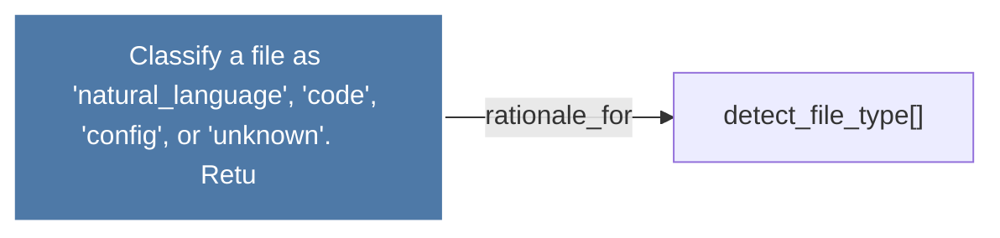

# Classify a file as 'natural_language', 'code', 'config', or 'unknown'.      Retu

> [!info] Properties
> **File Type**: rationale
> **Community**: [[_COMMUNITY_Community None|Community None]]
> **Degree**: 1

## Architecture Graph


## Outbound Connections
- [[detect_file_type()]] - `rationale_for` [EXTRACTED]

## Inbound Dependencies
> [!abstract]- Files that link here
```dataview
LIST
FROM [[Classify a file as 'natural_language', 'code', 'config', or 'unknown'.      Retu]]
```

#graphify/rationale #graphify/EXTRACTED #community/Community_None