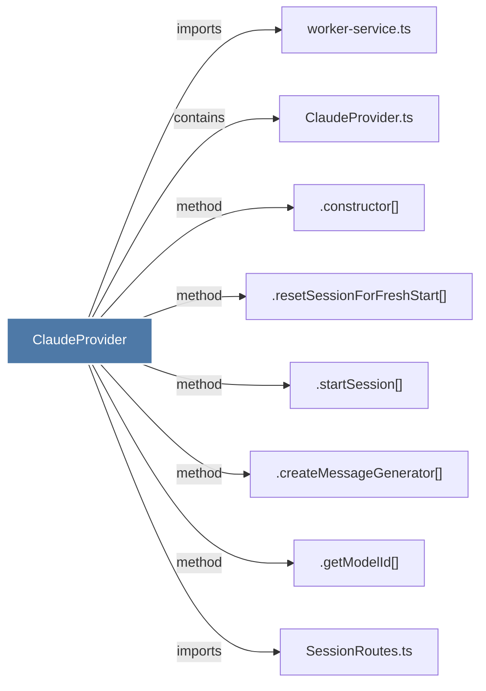

# ClaudeProvider

> [!info] Properties
> **File Type**: code
> **Community**: [[_COMMUNITY_Community None|Community None]]
> **Degree**: 8

## Architecture Graph


## Outbound Connections
- [[.constructor()_8]] - `method` [EXTRACTED]
- [[.createMessageGenerator()]] - `method` [EXTRACTED]
- [[.getModelId()]] - `method` [EXTRACTED]
- [[.resetSessionForFreshStart()]] - `method` [EXTRACTED]
- [[.startSession()]] - `method` [EXTRACTED]
- [[ClaudeProvider.ts]] - `contains` [EXTRACTED]
- [[SessionRoutes.ts]] - `imports` [EXTRACTED]
- [[worker-service.ts]] - `imports` [EXTRACTED]

## Inbound Dependencies
> [!abstract]- Files that link here
```dataview
LIST
FROM [[ClaudeProvider]]
```

#graphify/code #graphify/EXTRACTED #community/Community_None