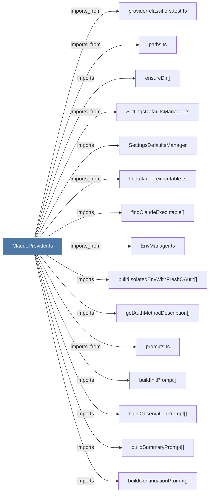

# ClaudeProvider.ts

> [!info] Properties
> **File Type**: code
> **Community**: [[_COMMUNITY_Community None|Community None]]
> **Degree**: 40

## Architecture Graph


## Outbound Connections
- [[ClassifiedProviderError]] - `imports` [EXTRACTED]
- [[ClaudeProvider]] - `contains` [EXTRACTED]
- [[DatabaseManager]] - `imports` [EXTRACTED]
- [[DatabaseManager.ts]] - `imports_from` [EXTRACTED]
- [[EnvManager.ts]] - `imports_from` [EXTRACTED]
- [[Logger]] - `imports` [EXTRACTED]
- [[ModeManager]] - `imports` [EXTRACTED]
- [[ModeManager.ts]] - `imports_from` [EXTRACTED]
- [[RateLimitStore.ts]] - `imports_from` [EXTRACTED]
- [[SessionManager]] - `imports` [EXTRACTED]
- [[SessionManager.ts]] - `imports_from` [EXTRACTED]
- [[SessionRoutes.ts]] - `imports_from` [EXTRACTED]
- [[SettingsDefaultsManager]] - `imports` [EXTRACTED]
- [[SettingsDefaultsManager.ts]] - `imports_from` [EXTRACTED]
- [[buildContinuationPrompt()]] - `imports` [EXTRACTED]
- [[buildInitPrompt()]] - `imports` [EXTRACTED]
- [[buildIsolatedEnvWithFreshOAuth()]] - `imports` [EXTRACTED]
- [[buildObservationPrompt()]] - `imports` [EXTRACTED]
- [[buildSummaryPrompt()]] - `imports` [EXTRACTED]
- [[classifyClaudeError()]] - `contains` [EXTRACTED]
- [[createSdkSpawnFactory()]] - `imports` [EXTRACTED]
- [[ensureDir()]] - `imports` [EXTRACTED]
- [[ensureSdkProcessExit()]] - `imports` [EXTRACTED]
- [[env-sanitizer.ts]] - `imports_from` [EXTRACTED]
- [[find-claude-executable.ts]] - `imports_from` [EXTRACTED]
- [[findClaudeExecutable()]] - `imports` [EXTRACTED]
- [[getAuthMethodDescription()]] - `imports` [EXTRACTED]
- [[getSdkProcessForSession()]] - `imports` [EXTRACTED]
- [[index.ts_4]] - `imports_from` [EXTRACTED]
- [[logger.ts]] - `imports_from` [EXTRACTED]
- [[paths.ts]] - `imports_from` [EXTRACTED]
- [[process-registry.ts]] - `imports_from` [EXTRACTED]
- [[prompts.ts]] - `imports_from` [EXTRACTED]
- [[provider-classifiers.test.ts]] - `imports_from` [EXTRACTED]
- [[provider-errors.ts]] - `imports_from` [EXTRACTED]
- [[sanitizeEnv()]] - `imports` [EXTRACTED]
- [[shouldAbortForQuota()]] - `imports` [EXTRACTED]
- [[waitForSlot()]] - `imports` [EXTRACTED]
- [[worker-service.ts]] - `imports_from` [EXTRACTED]
- [[worker-types.ts]] - `imports_from` [EXTRACTED]

## Inbound Dependencies
> [!abstract]- Files that link here
```dataview
LIST
FROM [[ClaudeProvider.ts]]
```

#graphify/code #graphify/EXTRACTED #community/Community_None