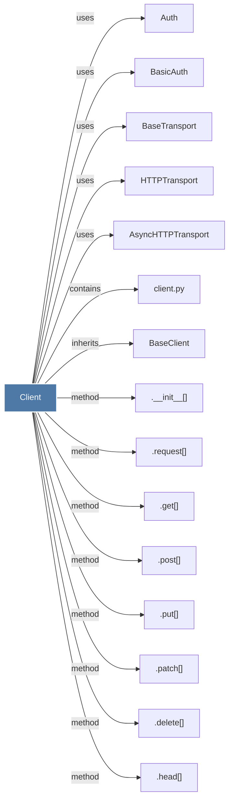

# Client

> [!info] Properties
> **File Type**: code
> **Community**: [[_COMMUNITY_Community None|Community None]]
> **Degree**: 27

## Architecture Graph


## Outbound Connections
- [[.__enter__()]] - `method` [EXTRACTED]
- [[.__exit__()]] - `method` [EXTRACTED]
- [[.__init__()_13]] - `method` [EXTRACTED]
- [[.close()_4]] - `method` [EXTRACTED]
- [[.delete()]] - `method` [EXTRACTED]
- [[.get()_3]] - `method` [EXTRACTED]
- [[.head()]] - `method` [EXTRACTED]
- [[.patch()]] - `method` [EXTRACTED]
- [[.post()_2]] - `method` [EXTRACTED]
- [[.put()]] - `method` [EXTRACTED]
- [[.request()]] - `method` [EXTRACTED]
- [[.send()]] - `method` [EXTRACTED]
- [[AsyncHTTPTransport]] - `uses` [INFERRED]
- [[Auth]] - `uses` [INFERRED]
- [[BaseClient]] - `inherits` [EXTRACTED]
- [[BaseTransport]] - `uses` [INFERRED]
- [[BasicAuth]] - `uses` [INFERRED]
- [[Cookies]] - `uses` [INFERRED]
- [[HTTPTransport]] - `uses` [INFERRED]
- [[Headers]] - `uses` [INFERRED]
- [[InvalidURL]] - `uses` [INFERRED]
- [[Request]] - `uses` [INFERRED]
- [[Response]] - `uses` [INFERRED]
- [[Synchronous HTTP client.]] - `rationale_for` [EXTRACTED]
- [[TooManyRedirects]] - `uses` [INFERRED]
- [[URL]] - `uses` [INFERRED]
- [[client.py]] - `contains` [EXTRACTED]

## Inbound Dependencies
> [!abstract]- Files that link here
```dataview
LIST
FROM [[Client]]
```

#graphify/code #graphify/EXTRACTED #community/Community_None