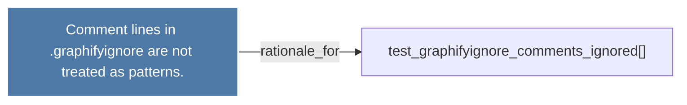

# Comment lines in .graphifyignore are not treated as patterns.

> [!info] Properties
> **File Type**: rationale
> **Community**: [[_COMMUNITY_Community None|Community None]]
> **Degree**: 1

## Architecture Graph


## Outbound Connections
- [[test_graphifyignore_comments_ignored()]] - `rationale_for` [EXTRACTED]

## Inbound Dependencies
> [!abstract]- Files that link here
```dataview
LIST
FROM [[Comment lines in .graphifyignore are not treated as patterns.]]
```

#graphify/rationale #graphify/EXTRACTED #community/Community_None