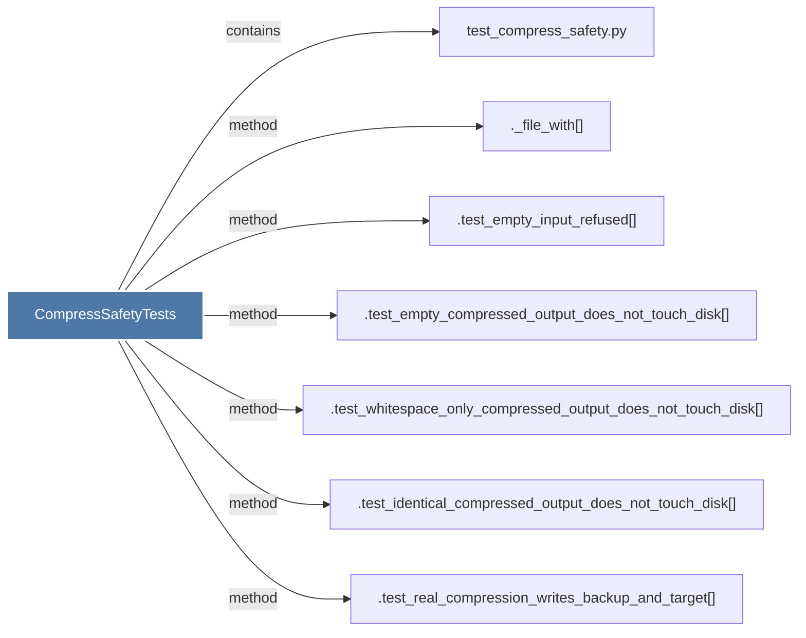

# CompressSafetyTests

> [!info] Properties
> **File Type**: code
> **Community**: [[_COMMUNITY_Community None|Community None]]
> **Degree**: 7

## Architecture Graph


## Outbound Connections
- [[._file_with()]] - `method` [EXTRACTED]
- [[.test_empty_compressed_output_does_not_touch_disk()]] - `method` [EXTRACTED]
- [[.test_empty_input_refused()]] - `method` [EXTRACTED]
- [[.test_identical_compressed_output_does_not_touch_disk()]] - `method` [EXTRACTED]
- [[.test_real_compression_writes_backup_and_target()]] - `method` [EXTRACTED]
- [[.test_whitespace_only_compressed_output_does_not_touch_disk()]] - `method` [EXTRACTED]
- [[test_compress_safety.py]] - `contains` [EXTRACTED]

## Inbound Dependencies
> [!abstract]- Files that link here
```dataview
LIST
FROM [[CompressSafetyTests]]
```

#graphify/code #graphify/EXTRACTED #community/Community_None