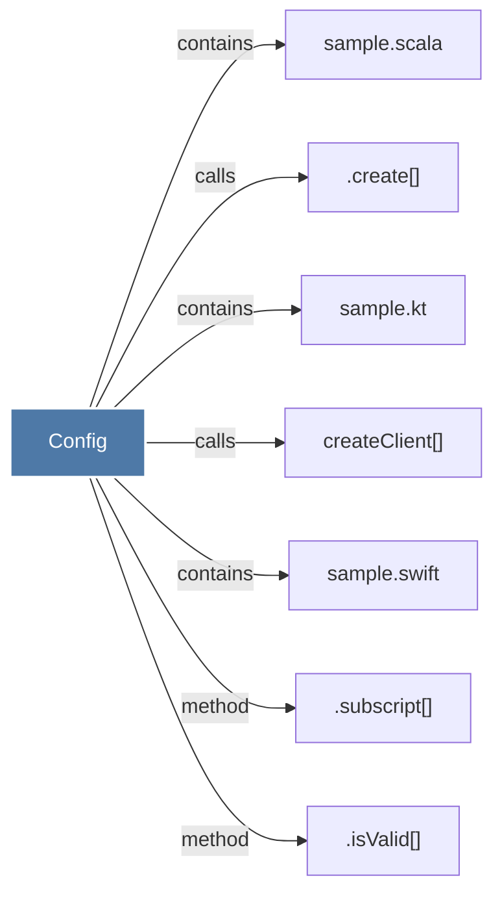

# Config

> [!info] Properties
> **File Type**: code
> **Community**: [[_COMMUNITY_Community None|Community None]]
> **Degree**: 7

## Architecture Graph


## Outbound Connections
- [[.create()]] - `calls` [EXTRACTED]
- [[.isValid()]] - `method` [EXTRACTED]
- [[.subscript()]] - `method` [EXTRACTED]
- [[createClient()]] - `calls` [EXTRACTED]
- [[sample.kt]] - `contains` [EXTRACTED]
- [[sample.scala]] - `contains` [EXTRACTED]
- [[sample.swift]] - `contains` [EXTRACTED]

## Inbound Dependencies
> [!abstract]- Files that link here
```dataview
LIST
FROM [[Config]]
```

#graphify/code #graphify/EXTRACTED #community/Community_None