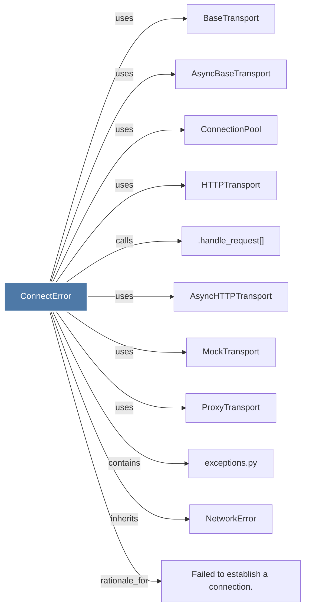

# ConnectError

> [!info] Properties
> **File Type**: code
> **Community**: [[_COMMUNITY_Community None|Community None]]
> **Degree**: 11

## Architecture Graph


## Outbound Connections
- [[.handle_request()_1]] - `calls` [INFERRED]
- [[AsyncBaseTransport]] - `uses` [INFERRED]
- [[AsyncHTTPTransport]] - `uses` [INFERRED]
- [[BaseTransport]] - `uses` [INFERRED]
- [[ConnectionPool]] - `uses` [INFERRED]
- [[Failed to establish a connection.]] - `rationale_for` [EXTRACTED]
- [[HTTPTransport]] - `uses` [INFERRED]
- [[MockTransport]] - `uses` [INFERRED]
- [[NetworkError_1]] - `inherits` [EXTRACTED]
- [[ProxyTransport]] - `uses` [INFERRED]
- [[exceptions.py]] - `contains` [EXTRACTED]

## Inbound Dependencies
> [!abstract]- Files that link here
```dataview
LIST
FROM [[ConnectError]]
```

#graphify/code #graphify/INFERRED #community/Community_None