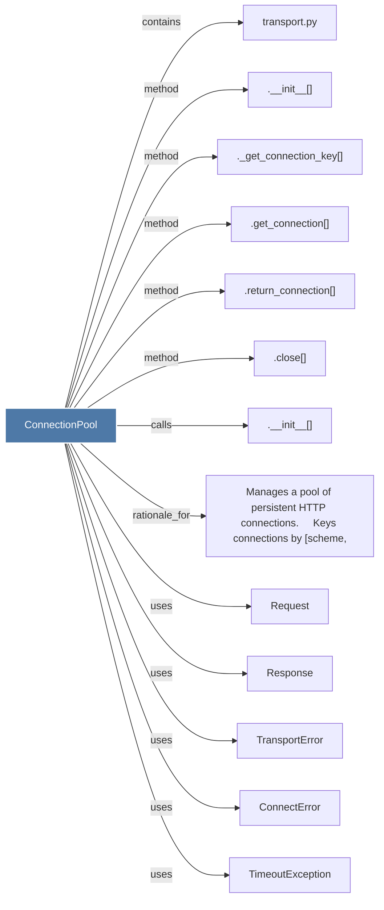

# ConnectionPool

> [!info] Properties
> **File Type**: code
> **Community**: [[_COMMUNITY_Community None|Community None]]
> **Degree**: 13

## Architecture Graph


## Outbound Connections
- [[.__init__()_5]] - `method` [EXTRACTED]
- [[.__init__()_6]] - `calls` [EXTRACTED]
- [[._get_connection_key()]] - `method` [EXTRACTED]
- [[.close()_1]] - `method` [EXTRACTED]
- [[.get_connection()]] - `method` [EXTRACTED]
- [[.return_connection()]] - `method` [EXTRACTED]
- [[ConnectError]] - `uses` [INFERRED]
- [[Manages a pool of persistent HTTP connections.     Keys connections by (scheme,]] - `rationale_for` [EXTRACTED]
- [[Request]] - `uses` [INFERRED]
- [[Response]] - `uses` [INFERRED]
- [[TimeoutException]] - `uses` [INFERRED]
- [[TransportError]] - `uses` [INFERRED]
- [[transport.py]] - `contains` [EXTRACTED]

## Inbound Dependencies
> [!abstract]- Files that link here
```dataview
LIST
FROM [[ConnectionPool]]
```

#graphify/code #graphify/EXTRACTED #community/Community_None