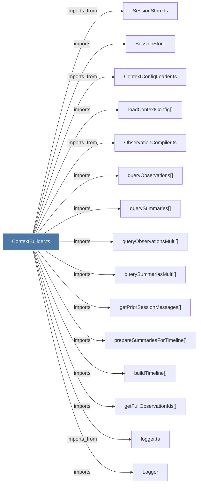

# ContextBuilder.ts

> [!info] Properties
> **File Type**: code
> **Community**: [[_COMMUNITY_Community None|Community None]]
> **Degree**: 36

## Architecture Graph


## Outbound Connections
- [[AgentFormatter.ts]] - `imports_from` [EXTRACTED]
- [[ContextConfigLoader.ts]] - `imports_from` [EXTRACTED]
- [[FooterRenderer.ts]] - `imports_from` [EXTRACTED]
- [[HeaderRenderer.ts]] - `imports_from` [EXTRACTED]
- [[HumanFormatter.ts]] - `imports_from` [EXTRACTED]
- [[Logger]] - `imports` [EXTRACTED]
- [[ObservationCompiler.ts]] - `imports_from` [EXTRACTED]
- [[SessionStore]] - `imports` [EXTRACTED]
- [[SessionStore.ts]] - `imports_from` [EXTRACTED]
- [[SummaryRenderer.ts]] - `imports_from` [EXTRACTED]
- [[TimelineRenderer.ts]] - `imports_from` [EXTRACTED]
- [[buildContextOutput()]] - `contains` [EXTRACTED]
- [[buildTimeline()]] - `imports` [EXTRACTED]
- [[generateContext()]] - `contains` [EXTRACTED]
- [[getFullObservationIds()]] - `imports` [EXTRACTED]
- [[getPriorSessionMessages()]] - `imports` [EXTRACTED]
- [[getProjectContext()]] - `imports` [EXTRACTED]
- [[initializeDatabase()_1]] - `contains` [EXTRACTED]
- [[loadContextConfig()]] - `imports` [EXTRACTED]
- [[logger.ts]] - `imports_from` [EXTRACTED]
- [[prepareSummariesForTimeline()]] - `imports` [EXTRACTED]
- [[project-name.ts]] - `imports_from` [EXTRACTED]
- [[queryObservations()]] - `imports` [EXTRACTED]
- [[queryObservationsMulti()]] - `imports` [EXTRACTED]
- [[querySummaries()]] - `imports` [EXTRACTED]
- [[querySummariesMulti()]] - `imports` [EXTRACTED]
- [[renderAgentEmptyState()]] - `imports` [EXTRACTED]
- [[renderEmptyState()]] - `contains` [EXTRACTED]
- [[renderFooter()]] - `imports` [EXTRACTED]
- [[renderHeader()]] - `imports` [EXTRACTED]
- [[renderHumanEmptyState()]] - `imports` [EXTRACTED]
- [[renderPreviouslySection()]] - `imports` [EXTRACTED]
- [[renderSummaryFields()]] - `imports` [EXTRACTED]
- [[renderTimeline()]] - `imports` [EXTRACTED]
- [[shouldShowSummary()]] - `imports` [EXTRACTED]
- [[types.ts_12]] - `imports_from` [EXTRACTED]

## Inbound Dependencies
> [!abstract]- Files that link here
```dataview
LIST
FROM [[ContextBuilder.ts]]
```

#graphify/code #graphify/EXTRACTED #community/Community_None