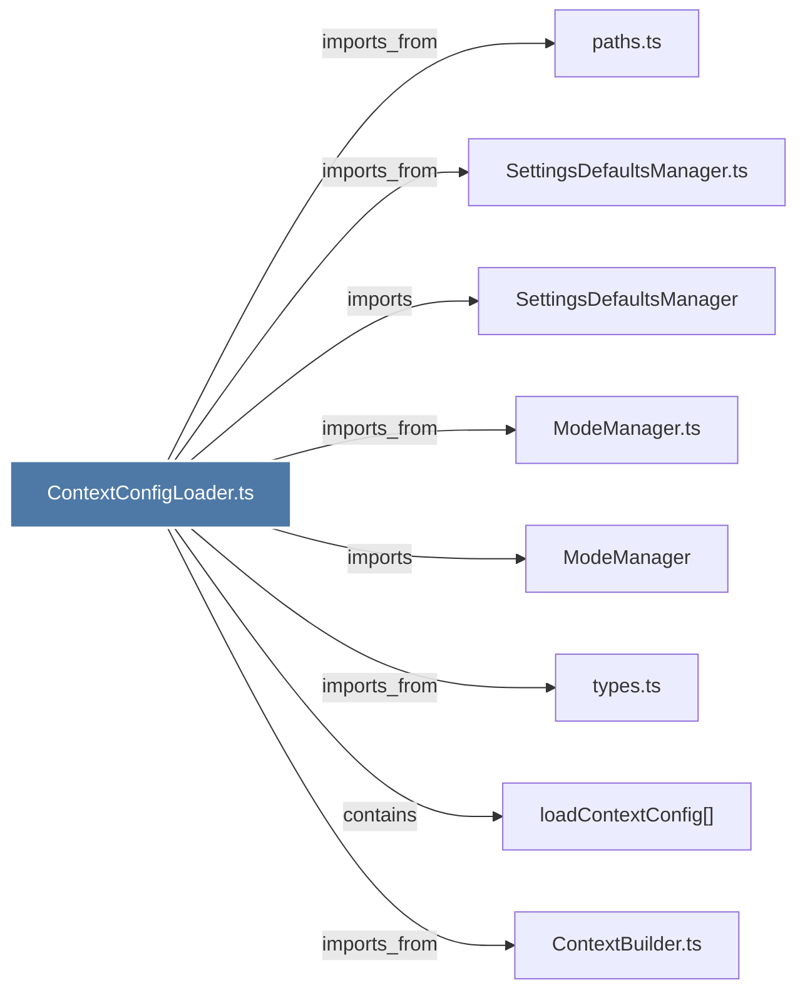

# ContextConfigLoader.ts

> [!info] Properties
> **File Type**: code
> **Community**: [[_COMMUNITY_Community None|Community None]]
> **Degree**: 8

## Architecture Graph


## Outbound Connections
- [[ContextBuilder.ts]] - `imports_from` [EXTRACTED]
- [[ModeManager]] - `imports` [EXTRACTED]
- [[ModeManager.ts]] - `imports_from` [EXTRACTED]
- [[SettingsDefaultsManager]] - `imports` [EXTRACTED]
- [[SettingsDefaultsManager.ts]] - `imports_from` [EXTRACTED]
- [[loadContextConfig()]] - `contains` [EXTRACTED]
- [[paths.ts]] - `imports_from` [EXTRACTED]
- [[types.ts_12]] - `imports_from` [EXTRACTED]

## Inbound Dependencies
> [!abstract]- Files that link here
```dataview
LIST
FROM [[ContextConfigLoader.ts]]
```

#graphify/code #graphify/EXTRACTED #community/Community_None