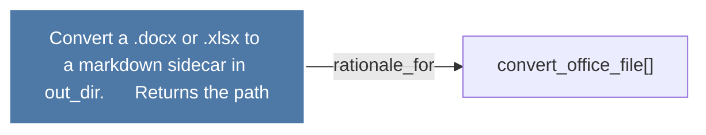

# Convert a .docx or .xlsx to a markdown sidecar in out_dir.      Returns the path

> [!info] Properties
> **File Type**: rationale
> **Community**: [[_COMMUNITY_Community None|Community None]]
> **Degree**: 1

## Architecture Graph


## Outbound Connections
- [[convert_office_file()]] - `rationale_for` [EXTRACTED]

## Inbound Dependencies
> [!abstract]- Files that link here
```dataview
LIST
FROM [[Convert a .docx or .xlsx to a markdown sidecar in out_dir.      Returns the path]]
```

#graphify/rationale #graphify/EXTRACTED #community/Community_None