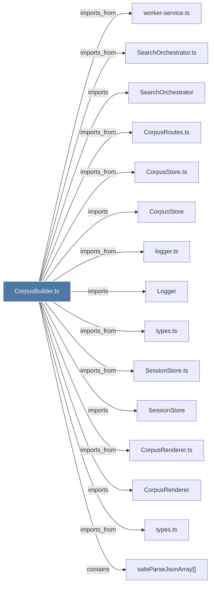

# CorpusBuilder.ts

> [!info] Properties
> **File Type**: code
> **Community**: [[_COMMUNITY_Community None|Community None]]
> **Degree**: 16

## Architecture Graph


## Outbound Connections
- [[CorpusBuilder]] - `contains` [EXTRACTED]
- [[CorpusRenderer]] - `imports` [EXTRACTED]
- [[CorpusRenderer.ts]] - `imports_from` [EXTRACTED]
- [[CorpusRoutes.ts]] - `imports_from` [EXTRACTED]
- [[CorpusStore]] - `imports` [EXTRACTED]
- [[CorpusStore.ts]] - `imports_from` [EXTRACTED]
- [[Logger]] - `imports` [EXTRACTED]
- [[SearchOrchestrator]] - `imports` [EXTRACTED]
- [[SearchOrchestrator.ts]] - `imports_from` [EXTRACTED]
- [[SessionStore]] - `imports` [EXTRACTED]
- [[SessionStore.ts]] - `imports_from` [EXTRACTED]
- [[logger.ts]] - `imports_from` [EXTRACTED]
- [[safeParseJsonArray()]] - `contains` [EXTRACTED]
- [[types.ts_6]] - `imports_from` [EXTRACTED]
- [[types.ts_3]] - `imports_from` [EXTRACTED]
- [[worker-service.ts]] - `imports_from` [EXTRACTED]

## Inbound Dependencies
> [!abstract]- Files that link here
```dataview
LIST
FROM [[CorpusBuilder.ts]]
```

#graphify/code #graphify/EXTRACTED #community/Community_None