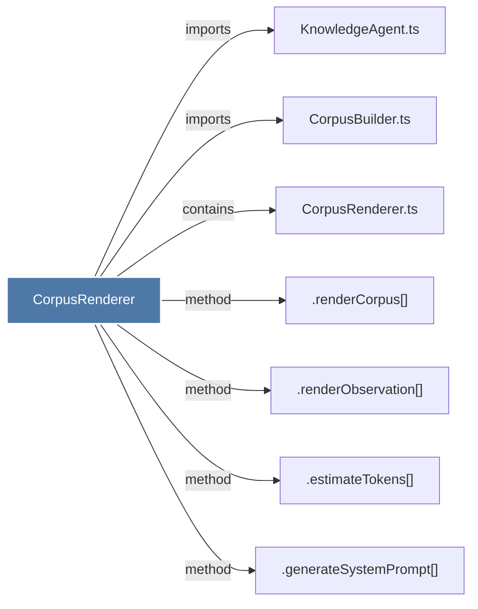

# CorpusRenderer

> [!info] Properties
> **File Type**: code
> **Community**: [[_COMMUNITY_Community None|Community None]]
> **Degree**: 7

## Architecture Graph


## Outbound Connections
- [[.estimateTokens()_2]] - `method` [EXTRACTED]
- [[.generateSystemPrompt()]] - `method` [EXTRACTED]
- [[.renderCorpus()]] - `method` [EXTRACTED]
- [[.renderObservation()]] - `method` [EXTRACTED]
- [[CorpusBuilder.ts]] - `imports` [EXTRACTED]
- [[CorpusRenderer.ts]] - `contains` [EXTRACTED]
- [[KnowledgeAgent.ts]] - `imports` [EXTRACTED]

## Inbound Dependencies
> [!abstract]- Files that link here
```dataview
LIST
FROM [[CorpusRenderer]]
```

#graphify/code #graphify/EXTRACTED #community/Community_None