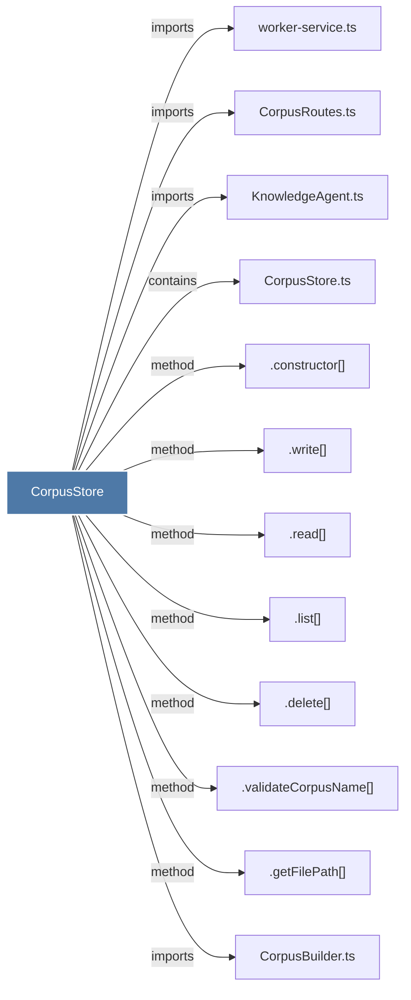

# CorpusStore

> [!info] Properties
> **File Type**: code
> **Community**: [[_COMMUNITY_Community None|Community None]]
> **Degree**: 12

## Architecture Graph


## Outbound Connections
- [[.constructor()_28]] - `method` [EXTRACTED]
- [[.delete()_3]] - `method` [EXTRACTED]
- [[.getFilePath()]] - `method` [EXTRACTED]
- [[.list()]] - `method` [EXTRACTED]
- [[.read()_1]] - `method` [EXTRACTED]
- [[.validateCorpusName()]] - `method` [EXTRACTED]
- [[.write()]] - `method` [EXTRACTED]
- [[CorpusBuilder.ts]] - `imports` [EXTRACTED]
- [[CorpusRoutes.ts]] - `imports` [EXTRACTED]
- [[CorpusStore.ts]] - `contains` [EXTRACTED]
- [[KnowledgeAgent.ts]] - `imports` [EXTRACTED]
- [[worker-service.ts]] - `imports` [EXTRACTED]

## Inbound Dependencies
> [!abstract]- Files that link here
```dataview
LIST
FROM [[CorpusStore]]
```

#graphify/code #graphify/EXTRACTED #community/Community_None