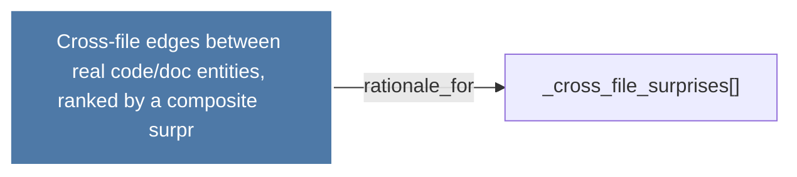

# Cross-file edges between real code/doc entities, ranked by a composite     surpr

> [!info] Properties
> **File Type**: rationale
> **Community**: [[_COMMUNITY_Community None|Community None]]
> **Degree**: 1

## Architecture Graph


## Outbound Connections
- [[_cross_file_surprises()_1]] - `rationale_for` [EXTRACTED]

## Inbound Dependencies
> [!abstract]- Files that link here
```dataview
LIST
FROM [[Cross-file edges between real codedoc entities, ranked by a composite     surpr_1]]
```

#graphify/rationale #graphify/EXTRACTED #community/Community_None