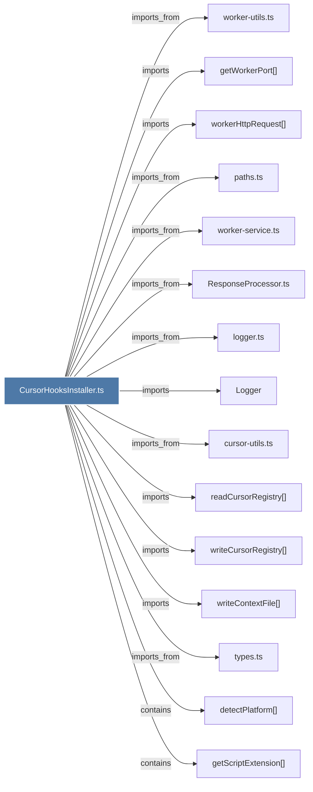

# CursorHooksInstaller.ts

> [!info] Properties
> **File Type**: code
> **Community**: [[_COMMUNITY_Community None|Community None]]
> **Degree**: 37

## Architecture Graph


## Outbound Connections
- [[GeminiCliHooksInstaller.ts]] - `imports_from` [EXTRACTED]
- [[Logger]] - `imports` [EXTRACTED]
- [[McpIntegrations.ts]] - `imports_from` [EXTRACTED]
- [[ResponseProcessor.ts]] - `imports_from` [EXTRACTED]
- [[WindsurfHooksInstaller.ts]] - `imports_from` [EXTRACTED]
- [[checkCursorHooksStatus()]] - `contains` [EXTRACTED]
- [[configureCursorMcp()]] - `contains` [EXTRACTED]
- [[cursor-utils.ts]] - `imports_from` [EXTRACTED]
- [[detectClaudeCode()]] - `contains` [EXTRACTED]
- [[detectPlatform()]] - `contains` [EXTRACTED]
- [[fetchInitialContextFromWorker()]] - `contains` [EXTRACTED]
- [[findBunPath()]] - `contains` [EXTRACTED]
- [[findMcpServerPath()]] - `contains` [EXTRACTED]
- [[findWorkerServicePath()]] - `contains` [EXTRACTED]
- [[getScriptExtension()]] - `contains` [EXTRACTED]
- [[getTargetDir()]] - `contains` [EXTRACTED]
- [[getWorkerPort()]] - `imports` [EXTRACTED]
- [[handleCursorCommand()]] - `contains` [EXTRACTED]
- [[installCursorHooks()]] - `contains` [EXTRACTED]
- [[logger.ts]] - `imports_from` [EXTRACTED]
- [[paths.ts]] - `imports_from` [EXTRACTED]
- [[readCursorRegistry()_1]] - `imports` [EXTRACTED]
- [[readCursorRegistry()]] - `contains` [EXTRACTED]
- [[registerCursorProject()]] - `contains` [EXTRACTED]
- [[removeCursorHooksFiles()]] - `contains` [EXTRACTED]
- [[setupProjectContext()]] - `contains` [EXTRACTED]
- [[types.ts_11]] - `imports_from` [EXTRACTED]
- [[uninstallCursorHooks()]] - `contains` [EXTRACTED]
- [[unregisterCursorProject()]] - `contains` [EXTRACTED]
- [[updateCursorContextForProject()]] - `contains` [EXTRACTED]
- [[worker-service.ts]] - `imports_from` [EXTRACTED]
- [[worker-utils.ts]] - `imports_from` [EXTRACTED]
- [[workerHttpRequest()]] - `imports` [EXTRACTED]
- [[writeContextFile()]] - `imports` [EXTRACTED]
- [[writeCursorRegistry()_1]] - `imports` [EXTRACTED]
- [[writeCursorRegistry()]] - `contains` [EXTRACTED]
- [[writeHooksJsonAndSetupProject()]] - `contains` [EXTRACTED]

## Inbound Dependencies
> [!abstract]- Files that link here
```dataview
LIST
FROM [[CursorHooksInstaller.ts]]
```

#graphify/code #graphify/EXTRACTED #community/Community_None