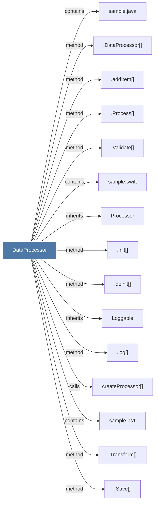

# DataProcessor

> [!info] Properties
> **File Type**: code
> **Community**: [[_COMMUNITY_Community None|Community None]]
> **Degree**: 18

## Architecture Graph


## Outbound Connections
- [[.DataProcessor()]] - `method` [EXTRACTED]
- [[.Process()]] - `method` [EXTRACTED]
- [[.Save()]] - `method` [EXTRACTED]
- [[.Transform()]] - `method` [EXTRACTED]
- [[.Validate()]] - `method` [EXTRACTED]
- [[.addItem()]] - `method` [EXTRACTED]
- [[.deinit()]] - `method` [EXTRACTED]
- [[.init()]] - `method` [EXTRACTED]
- [[.log()]] - `method` [EXTRACTED]
- [[HttpClient_1]] - `references` [EXTRACTED]
- [[IProcessor]] - `inherits` [EXTRACTED]
- [[Loggable]] - `inherits` [EXTRACTED]
- [[Processor]] - `inherits` [EXTRACTED]
- [[createProcessor()]] - `calls` [EXTRACTED]
- [[sample.cs]] - `contains` [EXTRACTED]
- [[sample.java]] - `contains` [EXTRACTED]
- [[sample.ps1]] - `contains` [EXTRACTED]
- [[sample.swift]] - `contains` [EXTRACTED]

## Inbound Dependencies
> [!abstract]- Files that link here
```dataview
LIST
FROM [[DataProcessor]]
```

#graphify/code #graphify/EXTRACTED #community/Community_None