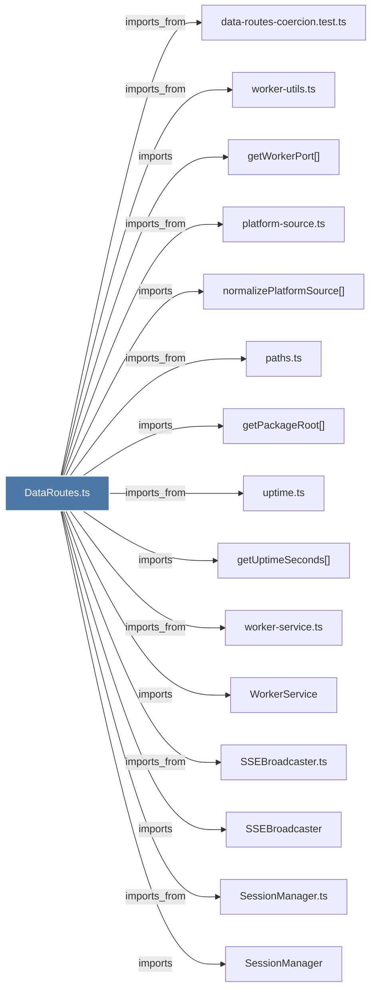

# DataRoutes.ts

> [!info] Properties
> **File Type**: code
> **Community**: [[_COMMUNITY_Community None|Community None]]
> **Degree**: 31

## Architecture Graph


## Outbound Connections
- [[BaseRouteHandler.ts]] - `imports_from` [EXTRACTED]
- [[DataRoutes]] - `contains` [EXTRACTED]
- [[DatabaseManager]] - `imports` [EXTRACTED]
- [[DatabaseManager.ts]] - `imports_from` [EXTRACTED]
- [[Logger]] - `imports` [EXTRACTED]
- [[PaginationHelper]] - `imports` [EXTRACTED]
- [[PaginationHelper.ts]] - `imports_from` [EXTRACTED]
- [[SSEBroadcaster]] - `imports` [EXTRACTED]
- [[SSEBroadcaster.ts]] - `imports_from` [EXTRACTED]
- [[SessionManager]] - `imports` [EXTRACTED]
- [[SessionManager.ts]] - `imports_from` [EXTRACTED]
- [[WorkerService]] - `imports` [EXTRACTED]
- [[data-routes-coercion.test.ts]] - `imports_from` [EXTRACTED]
- [[get.ts]] - `imports_from` [EXTRACTED]
- [[getFirstObservationCreatedAt()]] - `imports` [EXTRACTED]
- [[getObservationsByFilePath()]] - `imports` [EXTRACTED]
- [[getPackageRoot()]] - `imports` [EXTRACTED]
- [[getUptimeSeconds()]] - `imports` [EXTRACTED]
- [[getWorkerPort()]] - `imports` [EXTRACTED]
- [[logger.ts]] - `imports_from` [EXTRACTED]
- [[normalizePlatformSource()]] - `imports` [EXTRACTED]
- [[paths.ts]] - `imports_from` [EXTRACTED]
- [[platform-source.ts]] - `imports_from` [EXTRACTED]
- [[recent.ts]] - `imports_from` [EXTRACTED]
- [[safeParseJson()]] - `contains` [EXTRACTED]
- [[syncOne()]] - `contains` [EXTRACTED]
- [[uptime.ts]] - `imports_from` [EXTRACTED]
- [[validateBody()]] - `imports` [EXTRACTED]
- [[validateBody.ts]] - `imports_from` [EXTRACTED]
- [[worker-service.ts]] - `imports_from` [EXTRACTED]
- [[worker-utils.ts]] - `imports_from` [EXTRACTED]

## Inbound Dependencies
> [!abstract]- Files that link here
```dataview
LIST
FROM [[DataRoutes.ts]]
```

#graphify/code #graphify/EXTRACTED #community/Community_None