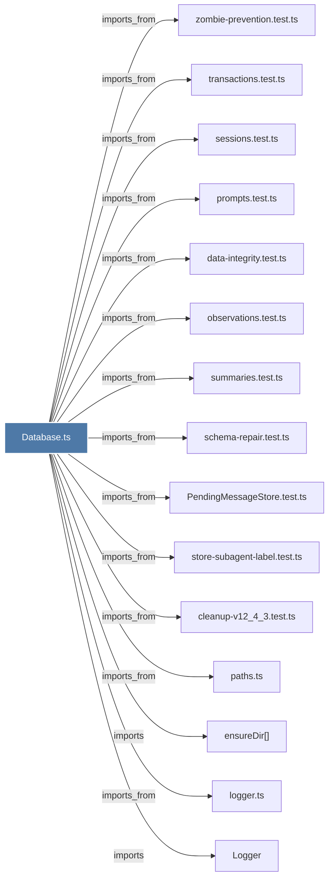

# Database.ts

> [!info] Properties
> **File Type**: code
> **Community**: [[_COMMUNITY_Community None|Community None]]
> **Degree**: 22

## Architecture Graph


## Outbound Connections
- [[ClaudeMemDatabase]] - `contains` [EXTRACTED]
- [[DatabaseManager_1]] - `contains` [EXTRACTED]
- [[Logger]] - `imports` [EXTRACTED]
- [[MigrationRunner]] - `imports` [EXTRACTED]
- [[PendingMessageStore.test.ts]] - `imports_from` [EXTRACTED]
- [[cleanup-v12_4_3.test.ts]] - `imports_from` [EXTRACTED]
- [[data-integrity.test.ts]] - `imports_from` [EXTRACTED]
- [[ensureDir()]] - `imports` [EXTRACTED]
- [[getDatabase()]] - `contains` [EXTRACTED]
- [[initializeDatabase()]] - `contains` [EXTRACTED]
- [[logger.ts]] - `imports_from` [EXTRACTED]
- [[migrations.ts]] - `imports_from` [EXTRACTED]
- [[observations.test.ts]] - `imports_from` [EXTRACTED]
- [[paths.ts]] - `imports_from` [EXTRACTED]
- [[prompts.test.ts_1]] - `imports_from` [EXTRACTED]
- [[runner.ts]] - `imports_from` [EXTRACTED]
- [[schema-repair.test.ts]] - `imports_from` [EXTRACTED]
- [[sessions.test.ts]] - `imports_from` [EXTRACTED]
- [[store-subagent-label.test.ts]] - `imports_from` [EXTRACTED]
- [[summaries.test.ts]] - `imports_from` [EXTRACTED]
- [[transactions.test.ts]] - `imports_from` [EXTRACTED]
- [[zombie-prevention.test.ts]] - `imports_from` [EXTRACTED]

## Inbound Dependencies
> [!abstract]- Files that link here
```dataview
LIST
FROM [[Database.ts]]
```

#graphify/code #graphify/EXTRACTED #community/Community_None