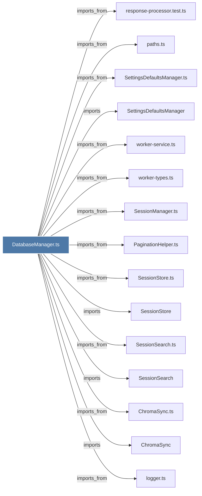

# DatabaseManager.ts

> [!info] Properties
> **File Type**: code
> **Community**: [[_COMMUNITY_Community None|Community None]]
> **Degree**: 28

## Architecture Graph


## Outbound Connections
- [[ChromaSync]] - `imports` [EXTRACTED]
- [[ChromaSync.ts]] - `imports_from` [EXTRACTED]
- [[ClaudeProvider.ts]] - `imports_from` [EXTRACTED]
- [[DataRoutes.ts]] - `imports_from` [EXTRACTED]
- [[DatabaseManager]] - `contains` [EXTRACTED]
- [[GeminiProvider.ts]] - `imports_from` [EXTRACTED]
- [[Logger]] - `imports` [EXTRACTED]
- [[MemoryRoutes.ts]] - `imports_from` [EXTRACTED]
- [[OpenRouterProvider.ts]] - `imports_from` [EXTRACTED]
- [[PaginationHelper.ts]] - `imports_from` [EXTRACTED]
- [[ResponseProcessor.ts]] - `imports_from` [EXTRACTED]
- [[SessionCompletionHandler.ts]] - `imports_from` [EXTRACTED]
- [[SessionManager.ts]] - `imports_from` [EXTRACTED]
- [[SessionRoutes.ts]] - `imports_from` [EXTRACTED]
- [[SessionSearch]] - `imports` [EXTRACTED]
- [[SessionSearch.ts]] - `imports_from` [EXTRACTED]
- [[SessionStore]] - `imports` [EXTRACTED]
- [[SessionStore.ts]] - `imports_from` [EXTRACTED]
- [[SettingsDefaultsManager]] - `imports` [EXTRACTED]
- [[SettingsDefaultsManager.ts]] - `imports_from` [EXTRACTED]
- [[SettingsManager.ts]] - `imports_from` [EXTRACTED]
- [[ViewerRoutes.ts]] - `imports_from` [EXTRACTED]
- [[logger.ts]] - `imports_from` [EXTRACTED]
- [[paths.ts]] - `imports_from` [EXTRACTED]
- [[response-processor.test.ts]] - `imports_from` [EXTRACTED]
- [[shared.ts]] - `imports_from` [EXTRACTED]
- [[worker-service.ts]] - `imports_from` [EXTRACTED]
- [[worker-types.ts]] - `imports_from` [EXTRACTED]

## Inbound Dependencies
> [!abstract]- Files that link here
```dataview
LIST
FROM [[DatabaseManager.ts]]
```

#graphify/code #graphify/EXTRACTED #community/Community_None