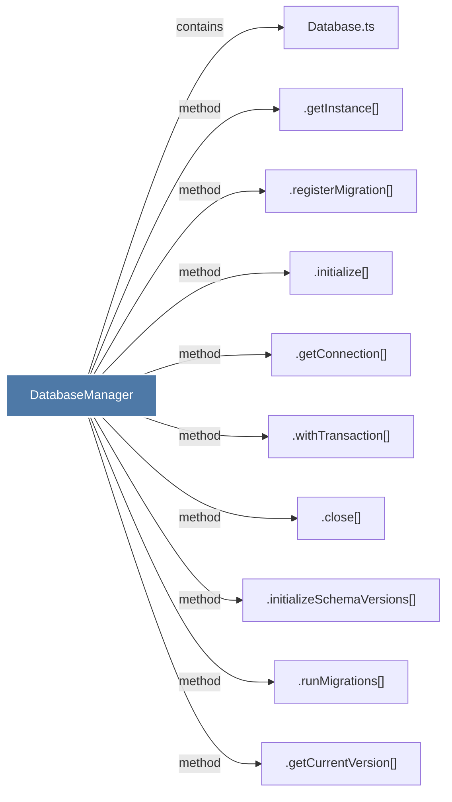

# DatabaseManager

> [!info] Properties
> **File Type**: code
> **Community**: [[_COMMUNITY_Community None|Community None]]
> **Degree**: 10

## Architecture Graph


## Outbound Connections
- [[.close()_8]] - `method` [EXTRACTED]
- [[.getConnection()]] - `method` [EXTRACTED]
- [[.getCurrentVersion()]] - `method` [EXTRACTED]
- [[.getInstance()_1]] - `method` [EXTRACTED]
- [[.initialize()_2]] - `method` [EXTRACTED]
- [[.initializeSchemaVersions()]] - `method` [EXTRACTED]
- [[.registerMigration()]] - `method` [EXTRACTED]
- [[.runMigrations()]] - `method` [EXTRACTED]
- [[.withTransaction()]] - `method` [EXTRACTED]
- [[Database.ts]] - `contains` [EXTRACTED]

## Inbound Dependencies
> [!abstract]- Files that link here
```dataview
LIST
FROM [[DatabaseManager_1]]
```

#graphify/code #graphify/EXTRACTED #community/Community_None