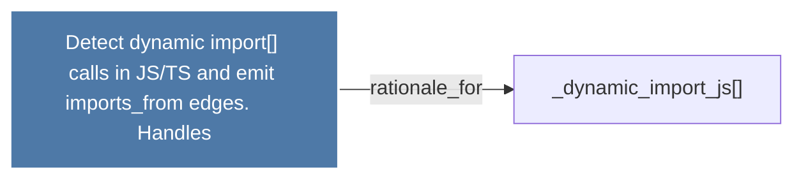

# Detect dynamic import() calls in JS/TS and emit imports_from edges.      Handles

> [!info] Properties
> **File Type**: rationale
> **Community**: [[_COMMUNITY_Community None|Community None]]
> **Degree**: 1

## Architecture Graph


## Outbound Connections
- [[_dynamic_import_js()]] - `rationale_for` [EXTRACTED]

## Inbound Dependencies
> [!abstract]- Files that link here
```dataview
LIST
FROM [[Detect dynamic import() calls in JSTS and emit imports_from edges.      Handles]]
```

#graphify/rationale #graphify/EXTRACTED #community/Community_None