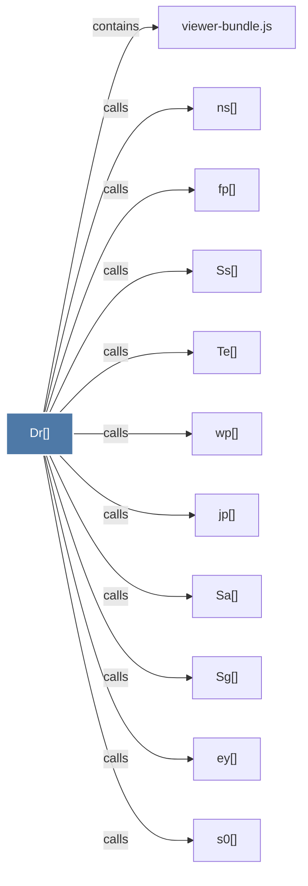

# Dr()

> [!info] Properties
> **File Type**: code
> **Community**: [[_COMMUNITY_Community None|Community None]]
> **Degree**: 11

## Architecture Graph


## Outbound Connections
- [[Sa()]] - `calls` [EXTRACTED]
- [[Sg()]] - `calls` [EXTRACTED]
- [[Ss()]] - `calls` [EXTRACTED]
- [[Te()]] - `calls` [EXTRACTED]
- [[ey()]] - `calls` [EXTRACTED]
- [[fp()]] - `calls` [EXTRACTED]
- [[jp()]] - `calls` [EXTRACTED]
- [[ns()]] - `calls` [EXTRACTED]
- [[s0()]] - `calls` [EXTRACTED]
- [[viewer-bundle.js]] - `contains` [EXTRACTED]
- [[wp()]] - `calls` [EXTRACTED]

## Inbound Dependencies
> [!abstract]- Files that link here
```dataview
LIST
FROM [[Dr()]]
```

#graphify/code #graphify/EXTRACTED #community/Community_None