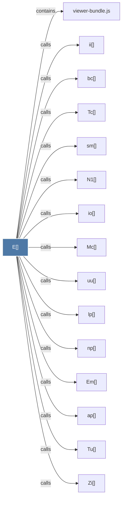

# E()

> [!info] Properties
> **File Type**: code
> **Community**: [[_COMMUNITY_Community None|Community None]]
> **Degree**: 61

## Architecture Graph


## Outbound Connections
- [[Bm()]] - `calls` [EXTRACTED]
- [[Da()]] - `calls` [EXTRACTED]
- [[Em()]] - `calls` [EXTRACTED]
- [[Gm()]] - `calls` [EXTRACTED]
- [[Hp()]] - `calls` [EXTRACTED]
- [[Ip()]] - `calls` [EXTRACTED]
- [[Mc()]] - `calls` [EXTRACTED]
- [[N1()]] - `calls` [EXTRACTED]
- [[Nr()]] - `calls` [EXTRACTED]
- [[Pv()]] - `calls` [EXTRACTED]
- [[Qv()]] - `calls` [EXTRACTED]
- [[Sg()]] - `calls` [EXTRACTED]
- [[Tc()]] - `calls` [EXTRACTED]
- [[Te()]] - `calls` [EXTRACTED]
- [[Tl()]] - `calls` [EXTRACTED]
- [[Tu()]] - `calls` [EXTRACTED]
- [[Uo()]] - `calls` [EXTRACTED]
- [[Ve()]] - `calls` [EXTRACTED]
- [[Wv()]] - `calls` [EXTRACTED]
- [[Xo()]] - `calls` [EXTRACTED]
- [[Zi()]] - `calls` [EXTRACTED]
- [[Zn()]] - `calls` [EXTRACTED]
- [[_g()]] - `calls` [EXTRACTED]
- [[_o()]] - `calls` [EXTRACTED]
- [[_p()]] - `calls` [EXTRACTED]
- [[ap()]] - `calls` [EXTRACTED]
- [[at()]] - `calls` [EXTRACTED]
- [[bc()]] - `calls` [EXTRACTED]
- [[bi()]] - `calls` [EXTRACTED]
- [[by()]] - `calls` [EXTRACTED]
- [[cd()]] - `calls` [EXTRACTED]
- [[ch()]] - `calls` [EXTRACTED]
- [[cy()]] - `calls` [EXTRACTED]
- [[ey()]] - `calls` [EXTRACTED]
- [[gr()]] - `calls` [EXTRACTED]
- [[ii()]] - `calls` [EXTRACTED]
- [[io()]] - `calls` [EXTRACTED]
- [[kp()]] - `calls` [EXTRACTED]
- [[lp()]] - `calls` [EXTRACTED]
- [[ly()]] - `calls` [EXTRACTED]
- [[md()]] - `calls` [EXTRACTED]
- [[mp()]] - `calls` [EXTRACTED]
- [[my()]] - `calls` [EXTRACTED]
- [[np()]] - `calls` [EXTRACTED]
- [[nt()]] - `calls` [EXTRACTED]
- [[ny()]] - `calls` [EXTRACTED]
- [[od()]] - `calls` [EXTRACTED]
- [[os()]] - `calls` [EXTRACTED]
- [[pl()]] - `calls` [EXTRACTED]
- [[qe()]] - `calls` [EXTRACTED]
- [[rh()]] - `calls` [EXTRACTED]
- [[s0()]] - `calls` [EXTRACTED]
- [[sm()]] - `calls` [EXTRACTED]
- [[ty()]] - `calls` [EXTRACTED]
- [[us()]] - `calls` [EXTRACTED]
- [[uu()]] - `calls` [EXTRACTED]
- [[viewer-bundle.js]] - `contains` [EXTRACTED]
- [[wp()]] - `calls` [EXTRACTED]
- [[xg()]] - `calls` [EXTRACTED]
- [[yg()]] - `calls` [EXTRACTED]
- [[zp()]] - `calls` [EXTRACTED]

## Inbound Dependencies
> [!abstract]- Files that link here
```dataview
LIST
FROM [[E()]]
```

#graphify/code #graphify/EXTRACTED #community/Community_None