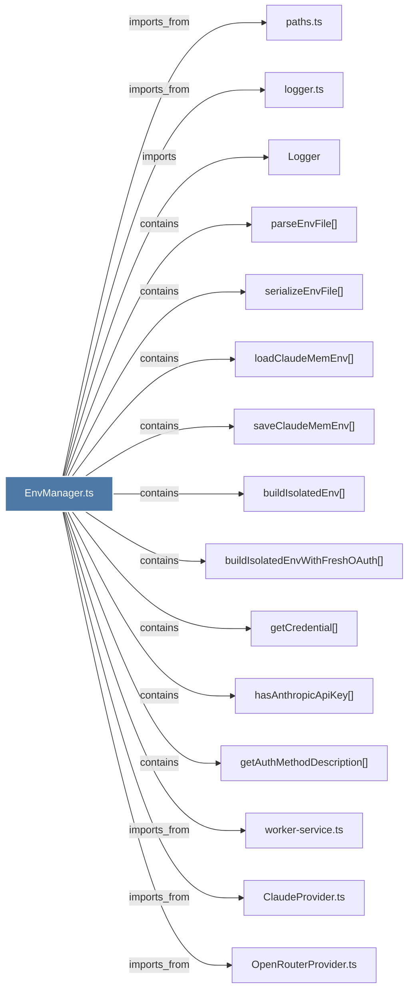

# EnvManager.ts

> [!info] Properties
> **File Type**: code
> **Community**: [[_COMMUNITY_Community None|Community None]]
> **Degree**: 17

## Architecture Graph


## Outbound Connections
- [[ClaudeProvider.ts]] - `imports_from` [EXTRACTED]
- [[GeminiProvider.ts]] - `imports_from` [EXTRACTED]
- [[KnowledgeAgent.ts]] - `imports_from` [EXTRACTED]
- [[Logger]] - `imports` [EXTRACTED]
- [[OpenRouterProvider.ts]] - `imports_from` [EXTRACTED]
- [[buildIsolatedEnv()]] - `contains` [EXTRACTED]
- [[buildIsolatedEnvWithFreshOAuth()]] - `contains` [EXTRACTED]
- [[getAuthMethodDescription()]] - `contains` [EXTRACTED]
- [[getCredential()]] - `contains` [EXTRACTED]
- [[hasAnthropicApiKey()]] - `contains` [EXTRACTED]
- [[loadClaudeMemEnv()]] - `contains` [EXTRACTED]
- [[logger.ts]] - `imports_from` [EXTRACTED]
- [[parseEnvFile()]] - `contains` [EXTRACTED]
- [[paths.ts]] - `imports_from` [EXTRACTED]
- [[saveClaudeMemEnv()]] - `contains` [EXTRACTED]
- [[serializeEnvFile()]] - `contains` [EXTRACTED]
- [[worker-service.ts]] - `imports_from` [EXTRACTED]

## Inbound Dependencies
> [!abstract]- Files that link here
```dataview
LIST
FROM [[EnvManager.ts]]
```

#graphify/code #graphify/EXTRACTED #community/Community_None