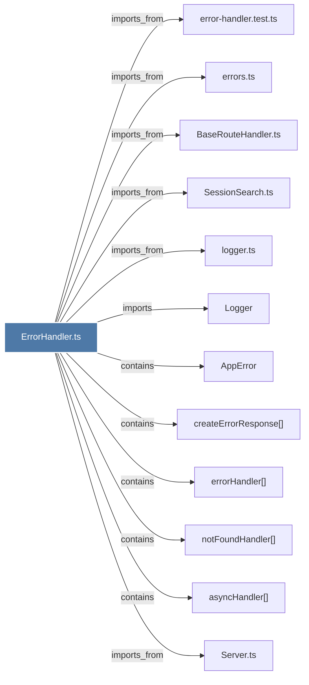

# ErrorHandler.ts

> [!info] Properties
> **File Type**: code
> **Community**: [[_COMMUNITY_Community None|Community None]]
> **Degree**: 12

## Architecture Graph


## Outbound Connections
- [[AppError]] - `contains` [EXTRACTED]
- [[BaseRouteHandler.ts]] - `imports_from` [EXTRACTED]
- [[Logger]] - `imports` [EXTRACTED]
- [[Server.ts]] - `imports_from` [EXTRACTED]
- [[SessionSearch.ts]] - `imports_from` [EXTRACTED]
- [[asyncHandler()]] - `contains` [EXTRACTED]
- [[createErrorResponse()]] - `contains` [EXTRACTED]
- [[error-handler.test.ts]] - `imports_from` [EXTRACTED]
- [[errorHandler()]] - `contains` [EXTRACTED]
- [[errors.ts_1]] - `imports_from` [EXTRACTED]
- [[logger.ts]] - `imports_from` [EXTRACTED]
- [[notFoundHandler()]] - `contains` [EXTRACTED]

## Inbound Dependencies
> [!abstract]- Files that link here
```dataview
LIST
FROM [[ErrorHandler.ts]]
```

#graphify/code #graphify/EXTRACTED #community/Community_None