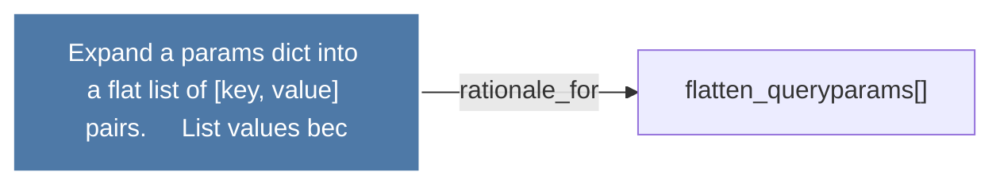

# Expand a params dict into a flat list of (key, value) pairs.     List values bec

> [!info] Properties
> **File Type**: rationale
> **Community**: [[_COMMUNITY_Community None|Community None]]
> **Degree**: 1

## Architecture Graph


## Outbound Connections
- [[flatten_queryparams()]] - `rationale_for` [EXTRACTED]

## Inbound Dependencies
> [!abstract]- Files that link here
```dataview
LIST
FROM [[Expand a params dict into a flat list of (key, value) pairs.     List values bec]]
```

#graphify/rationale #graphify/EXTRACTED #community/Community_None