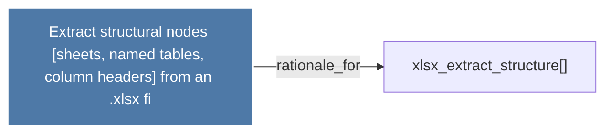

# Extract structural nodes (sheets, named tables, column headers) from an .xlsx fi

> [!info] Properties
> **File Type**: rationale
> **Community**: [[_COMMUNITY_Community None|Community None]]
> **Degree**: 1

## Architecture Graph


## Outbound Connections
- [[xlsx_extract_structure()]] - `rationale_for` [EXTRACTED]

## Inbound Dependencies
> [!abstract]- Files that link here
```dataview
LIST
FROM [[Extract structural nodes (sheets, named tables, column headers) from an .xlsx fi]]
```

#graphify/rationale #graphify/EXTRACTED #community/Community_None