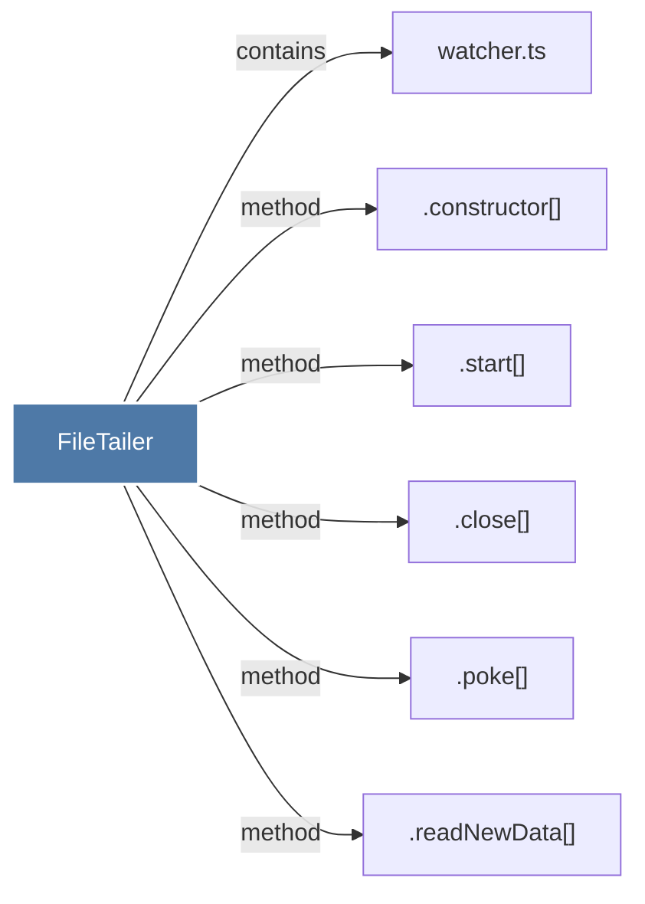

# FileTailer

> [!info] Properties
> **File Type**: code
> **Community**: [[_COMMUNITY_Community None|Community None]]
> **Degree**: 6

## Architecture Graph


## Outbound Connections
- [[.close()_6]] - `method` [EXTRACTED]
- [[.constructor()_32]] - `method` [EXTRACTED]
- [[.poke()]] - `method` [EXTRACTED]
- [[.readNewData()]] - `method` [EXTRACTED]
- [[.start()_1]] - `method` [EXTRACTED]
- [[watcher.ts]] - `contains` [EXTRACTED]

## Inbound Dependencies
> [!abstract]- Files that link here
```dataview
LIST
FROM [[FileTailer]]
```

#graphify/code #graphify/EXTRACTED #community/Community_None