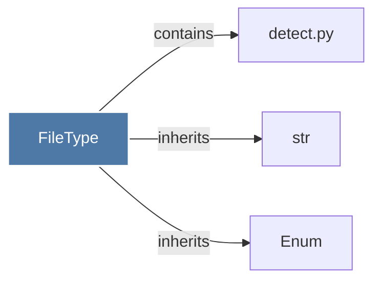

# FileType

> [!info] Properties
> **File Type**: code
> **Community**: [[_COMMUNITY_Community None|Community None]]
> **Degree**: 3

## Architecture Graph


## Outbound Connections
- [[Enum]] - `inherits` [EXTRACTED]
- [[detect.py]] - `contains` [EXTRACTED]
- [[str]] - `inherits` [EXTRACTED]

## Inbound Dependencies
> [!abstract]- Files that link here
```dataview
LIST
FROM [[FileType]]
```

#graphify/code #graphify/EXTRACTED #community/Community_None