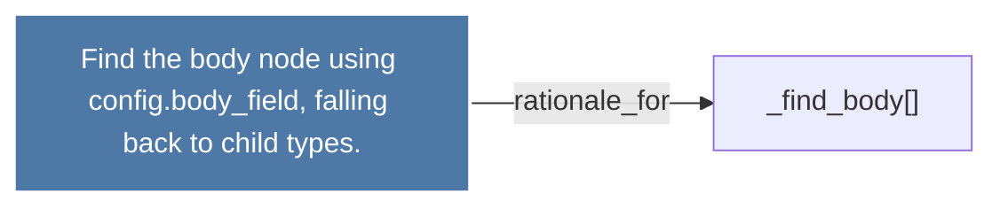

# Find the body node using config.body_field, falling back to child types.

> [!info] Properties
> **File Type**: rationale
> **Community**: [[_COMMUNITY_Community None|Community None]]
> **Degree**: 1

## Architecture Graph


## Outbound Connections
- [[_find_body()]] - `rationale_for` [EXTRACTED]

## Inbound Dependencies
> [!abstract]- Files that link here
```dataview
LIST
FROM [[Find the body node using config.body_field, falling back to child types.]]
```

#graphify/rationale #graphify/EXTRACTED #community/Community_None