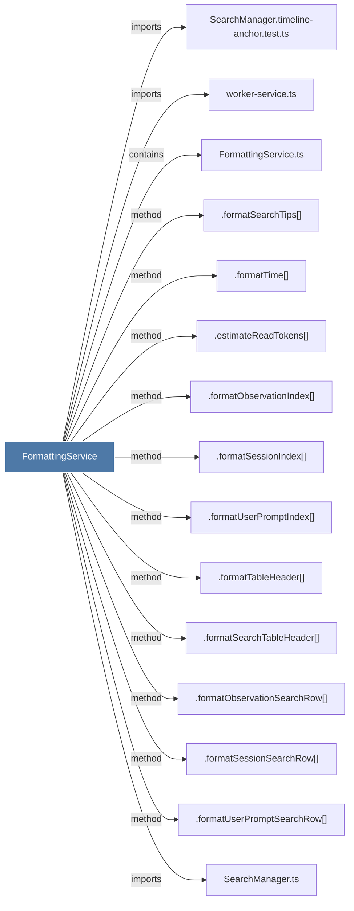

# FormattingService

> [!info] Properties
> **File Type**: code
> **Community**: [[_COMMUNITY_Community None|Community None]]
> **Degree**: 15

## Architecture Graph


## Outbound Connections
- [[.estimateReadTokens()]] - `method` [EXTRACTED]
- [[.formatObservationIndex()]] - `method` [EXTRACTED]
- [[.formatObservationSearchRow()]] - `method` [EXTRACTED]
- [[.formatSearchTableHeader()]] - `method` [EXTRACTED]
- [[.formatSearchTips()]] - `method` [EXTRACTED]
- [[.formatSessionIndex()]] - `method` [EXTRACTED]
- [[.formatSessionSearchRow()]] - `method` [EXTRACTED]
- [[.formatTableHeader()]] - `method` [EXTRACTED]
- [[.formatTime()]] - `method` [EXTRACTED]
- [[.formatUserPromptIndex()]] - `method` [EXTRACTED]
- [[.formatUserPromptSearchRow()]] - `method` [EXTRACTED]
- [[FormattingService.ts]] - `contains` [EXTRACTED]
- [[SearchManager.timeline-anchor.test.ts]] - `imports` [EXTRACTED]
- [[SearchManager.ts]] - `imports` [EXTRACTED]
- [[worker-service.ts]] - `imports` [EXTRACTED]

## Inbound Dependencies
> [!abstract]- Files that link here
```dataview
LIST
FROM [[FormattingService]]
```

#graphify/code #graphify/EXTRACTED #community/Community_None