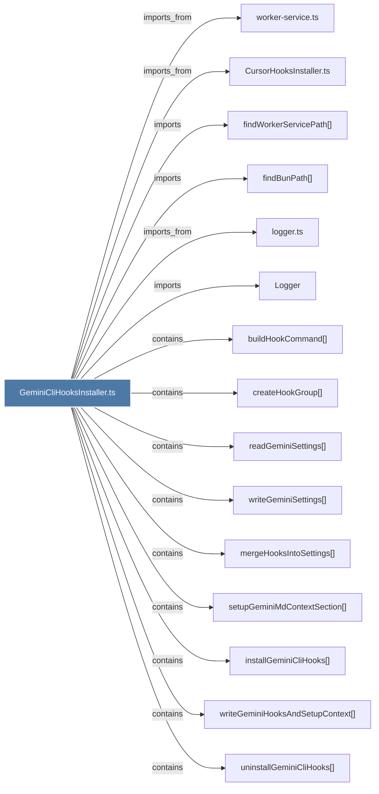

# GeminiCliHooksInstaller.ts

> [!info] Properties
> **File Type**: code
> **Community**: [[_COMMUNITY_Community None|Community None]]
> **Degree**: 18

## Architecture Graph


## Outbound Connections
- [[CursorHooksInstaller.ts]] - `imports_from` [EXTRACTED]
- [[Logger]] - `imports` [EXTRACTED]
- [[buildHookCommand()_1]] - `contains` [EXTRACTED]
- [[checkGeminiCliHooksStatus()]] - `contains` [EXTRACTED]
- [[createHookGroup()]] - `contains` [EXTRACTED]
- [[findBunPath()]] - `imports` [EXTRACTED]
- [[findWorkerServicePath()]] - `imports` [EXTRACTED]
- [[handleGeminiCliCommand()]] - `contains` [EXTRACTED]
- [[installGeminiCliHooks()]] - `contains` [EXTRACTED]
- [[logger.ts]] - `imports_from` [EXTRACTED]
- [[mergeHooksIntoSettings()]] - `contains` [EXTRACTED]
- [[readGeminiSettings()]] - `contains` [EXTRACTED]
- [[setupGeminiMdContextSection()]] - `contains` [EXTRACTED]
- [[uninstallGeminiCliHooks()]] - `contains` [EXTRACTED]
- [[worker-service.ts]] - `imports_from` [EXTRACTED]
- [[writeGeminiHooksAndSetupContext()]] - `contains` [EXTRACTED]
- [[writeGeminiSettings()]] - `contains` [EXTRACTED]
- [[writeSettingsAndCleanupGeminiContext()]] - `contains` [EXTRACTED]

## Inbound Dependencies
> [!abstract]- Files that link here
```dataview
LIST
FROM [[GeminiCliHooksInstaller.ts]]
```

#graphify/code #graphify/EXTRACTED #community/Community_None