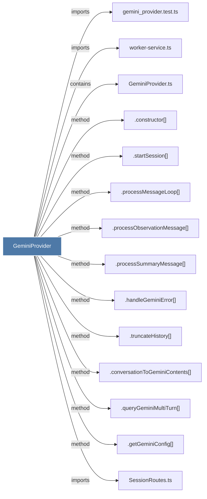

# GeminiProvider

> [!info] Properties
> **File Type**: code
> **Community**: [[_COMMUNITY_Community None|Community None]]
> **Degree**: 14

## Architecture Graph


## Outbound Connections
- [[.constructor()_11]] - `method` [EXTRACTED]
- [[.conversationToGeminiContents()]] - `method` [EXTRACTED]
- [[.getGeminiConfig()]] - `method` [EXTRACTED]
- [[.handleGeminiError()]] - `method` [EXTRACTED]
- [[.processMessageLoop()]] - `method` [EXTRACTED]
- [[.processObservationMessage()_1]] - `method` [EXTRACTED]
- [[.processSummaryMessage()_1]] - `method` [EXTRACTED]
- [[.queryGeminiMultiTurn()]] - `method` [EXTRACTED]
- [[.startSession()_2]] - `method` [EXTRACTED]
- [[.truncateHistory()_1]] - `method` [EXTRACTED]
- [[GeminiProvider.ts]] - `contains` [EXTRACTED]
- [[SessionRoutes.ts]] - `imports` [EXTRACTED]
- [[gemini_provider.test.ts]] - `imports` [EXTRACTED]
- [[worker-service.ts]] - `imports` [EXTRACTED]

## Inbound Dependencies
> [!abstract]- Files that link here
```dataview
LIST
FROM [[GeminiProvider]]
```

#graphify/code #graphify/EXTRACTED #community/Community_None