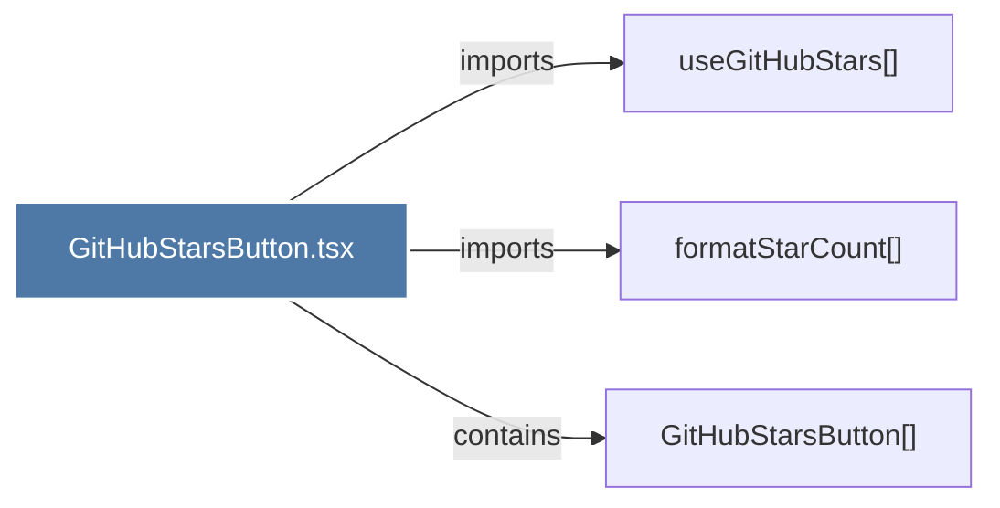

# GitHubStarsButton.tsx

> [!info] Properties
> **File Type**: code
> **Community**: [[_COMMUNITY_Community None|Community None]]
> **Degree**: 3

## Architecture Graph


## Outbound Connections
- [[GitHubStarsButton()]] - `contains` [EXTRACTED]
- [[formatStarCount()]] - `imports` [EXTRACTED]
- [[useGitHubStars()]] - `imports` [EXTRACTED]

## Inbound Dependencies
> [!abstract]- Files that link here
```dataview
LIST
FROM [[GitHubStarsButton.tsx]]
```

#graphify/code #graphify/EXTRACTED #community/Community_None