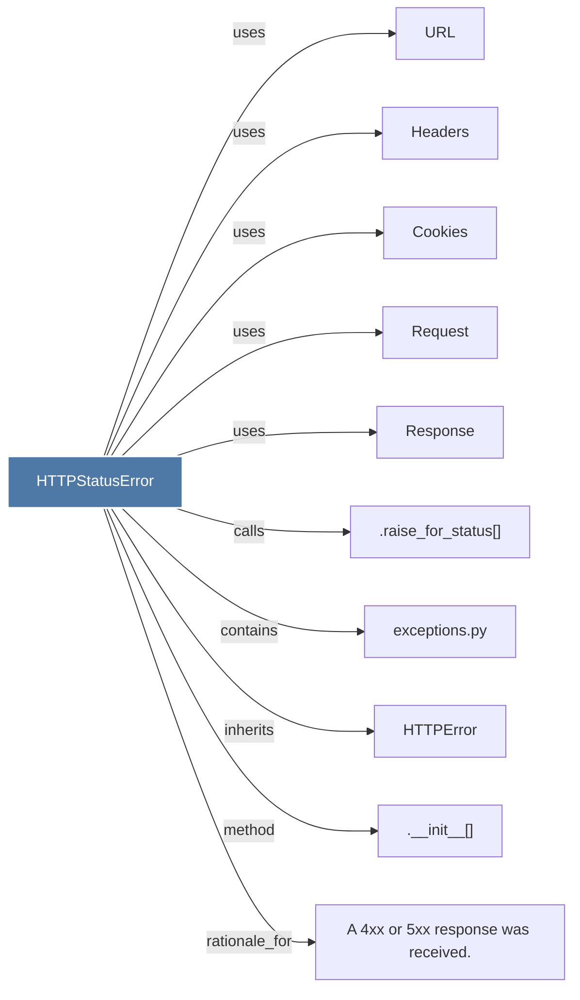

# HTTPStatusError

> [!info] Properties
> **File Type**: code
> **Community**: [[_COMMUNITY_Community None|Community None]]
> **Degree**: 10

## Architecture Graph


## Outbound Connections
- [[.__init__()_21]] - `method` [EXTRACTED]
- [[.raise_for_status()]] - `calls` [INFERRED]
- [[A 4xx or 5xx response was received.]] - `rationale_for` [EXTRACTED]
- [[Cookies]] - `uses` [INFERRED]
- [[HTTPError]] - `inherits` [EXTRACTED]
- [[Headers]] - `uses` [INFERRED]
- [[Request]] - `uses` [INFERRED]
- [[Response]] - `uses` [INFERRED]
- [[URL]] - `uses` [INFERRED]
- [[exceptions.py]] - `contains` [EXTRACTED]

## Inbound Dependencies
> [!abstract]- Files that link here
```dataview
LIST
FROM [[HTTPStatusError]]
```

#graphify/code #graphify/INFERRED #community/Community_None