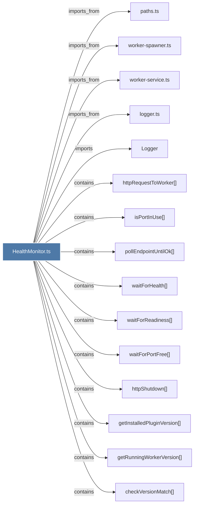

# HealthMonitor.ts

> [!info] Properties
> **File Type**: code
> **Community**: [[_COMMUNITY_Community None|Community None]]
> **Degree**: 15

## Architecture Graph


## Outbound Connections
- [[Logger]] - `imports` [EXTRACTED]
- [[checkVersionMatch()]] - `contains` [EXTRACTED]
- [[getInstalledPluginVersion()]] - `contains` [EXTRACTED]
- [[getRunningWorkerVersion()]] - `contains` [EXTRACTED]
- [[httpRequestToWorker()]] - `contains` [EXTRACTED]
- [[httpShutdown()]] - `contains` [EXTRACTED]
- [[isPortInUse()_1]] - `contains` [EXTRACTED]
- [[logger.ts]] - `imports_from` [EXTRACTED]
- [[paths.ts]] - `imports_from` [EXTRACTED]
- [[pollEndpointUntilOk()]] - `contains` [EXTRACTED]
- [[waitForHealth()_1]] - `contains` [EXTRACTED]
- [[waitForPortFree()]] - `contains` [EXTRACTED]
- [[waitForReadiness()]] - `contains` [EXTRACTED]
- [[worker-service.ts]] - `imports_from` [EXTRACTED]
- [[worker-spawner.ts]] - `imports_from` [EXTRACTED]

## Inbound Dependencies
> [!abstract]- Files that link here
```dataview
LIST
FROM [[HealthMonitor.ts]]
```

#graphify/code #graphify/EXTRACTED #community/Community_None