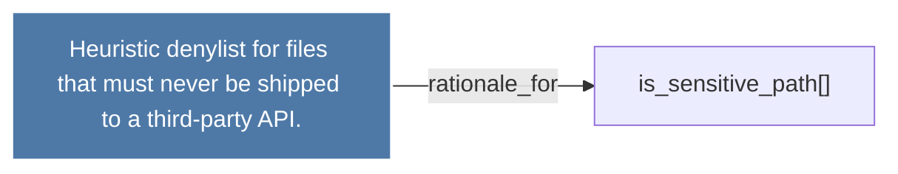

# Heuristic denylist for files that must never be shipped to a third-party API.

> [!info] Properties
> **File Type**: rationale
> **Community**: [[_COMMUNITY_Community None|Community None]]
> **Degree**: 1

## Architecture Graph


## Outbound Connections
- [[is_sensitive_path()]] - `rationale_for` [EXTRACTED]

## Inbound Dependencies
> [!abstract]- Files that link here
```dataview
LIST
FROM [[Heuristic denylist for files that must never be shipped to a third-party API.]]
```

#graphify/rationale #graphify/EXTRACTED #community/Community_None