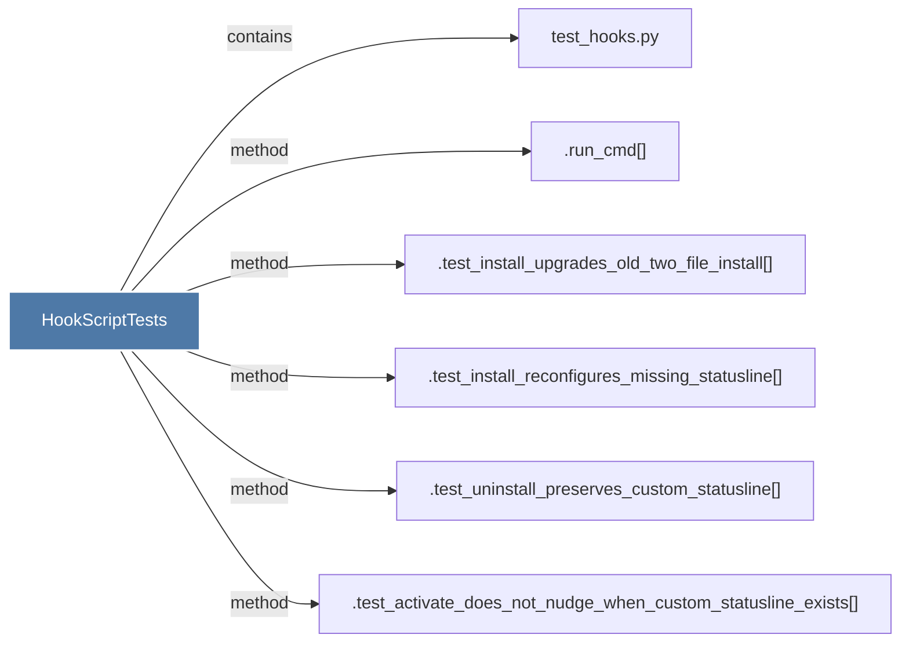

# HookScriptTests

> [!info] Properties
> **File Type**: code
> **Community**: [[_COMMUNITY_Community None|Community None]]
> **Degree**: 6

## Architecture Graph


## Outbound Connections
- [[.run_cmd()]] - `method` [EXTRACTED]
- [[.test_activate_does_not_nudge_when_custom_statusline_exists()]] - `method` [EXTRACTED]
- [[.test_install_reconfigures_missing_statusline()]] - `method` [EXTRACTED]
- [[.test_install_upgrades_old_two_file_install()]] - `method` [EXTRACTED]
- [[.test_uninstall_preserves_custom_statusline()]] - `method` [EXTRACTED]
- [[test_hooks.py_1]] - `contains` [EXTRACTED]

## Inbound Dependencies
> [!abstract]- Files that link here
```dataview
LIST
FROM [[HookScriptTests]]
```

#graphify/code #graphify/EXTRACTED #community/Community_None