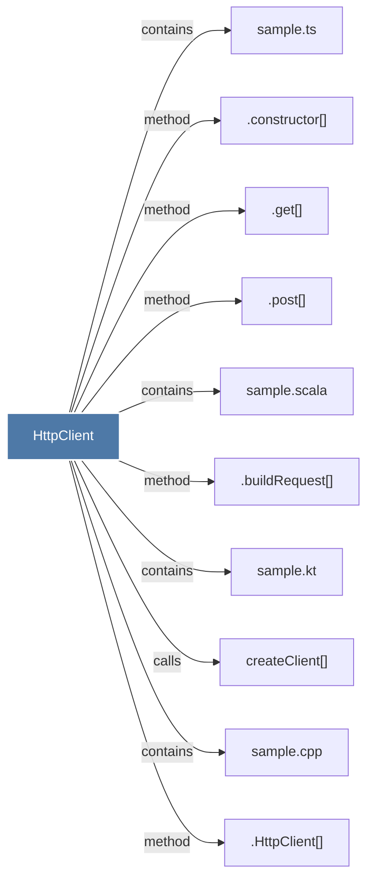

# HttpClient

> [!info] Properties
> **File Type**: code
> **Community**: [[_COMMUNITY_Community None|Community None]]
> **Degree**: 10

## Architecture Graph


## Outbound Connections
- [[.HttpClient()]] - `method` [EXTRACTED]
- [[.buildRequest()]] - `method` [EXTRACTED]
- [[.constructor()]] - `method` [EXTRACTED]
- [[.get()_1]] - `method` [EXTRACTED]
- [[.post()_1]] - `method` [EXTRACTED]
- [[createClient()]] - `calls` [EXTRACTED]
- [[sample.cpp]] - `contains` [EXTRACTED]
- [[sample.kt]] - `contains` [EXTRACTED]
- [[sample.scala]] - `contains` [EXTRACTED]
- [[sample.ts]] - `contains` [EXTRACTED]

## Inbound Dependencies
> [!abstract]- Files that link here
```dataview
LIST
FROM [[HttpClient]]
```

#graphify/code #graphify/EXTRACTED #community/Community_None